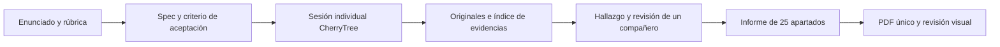

# Arquitectura documental y harness

SDD significa aquí especificar qué se pretende demostrar y cómo se aceptará el resultado antes de realizar cada prueba. El harness es el conjunto de instrucciones, plantillas, registros y controles que mantiene ese flujo verificable; no necesita un servicio web ni un framework de agentes.

## Fuentes de verdad

| Información | Fuente editable |
|---|---|
| Requisito académico | PDF del docente; análisis con páginas en docs |
| Plan y tareas | specs/001-documentacion/ |
| Estado actual y próxima acción | docs/estado.md |
| Nota de campo | Cuaderno activo según cherrytree/cuadernos.json; una sola persona lo edita |
| Evidencia original | evidencias/originales/ y su SHA-256 |
| Metadatos de evidencia | evidencias/indice.csv |
| Hallazgo revisado | hallazgos/PT-NNN.md e indice.csv |
| Texto de entrega | informe/INFORME.md |

La consolidación CherryTree reúne notas; el informe es la fuente editorial final. Si una nota contradice una ficha, resolver contra evidencia original y registrar el cambio; no mantener dos versiones técnicas incompatibles. No fusionar pruebas de instancias distintas como si fueran una sesión única.

## Puertas de calidad

1. **Antes de probar:** objetivo y red identificados, hipótesis, alcance, condición de parada y resultado esperado.
2. **Al capturar:** autor, fecha, instancia, comando, herramienta/versión, salida/captura y explicación.
3. **Al confirmar:** validación suficiente, precondiciones y limitaciones, evidencia propia y revisión cruzada.
4. **Al integrar:** PT y EV enlazados; figura legible con explicación y remediación verificable.
5. **Al entregar:** PDF único, 25 apartados, cero pendientes injustificados, referencias y defensa compartida.

`python3 scripts/validar.py` revisa XML/SQLite de los cuadernos activos, índices, IDs, rutas, hashes, referencias de hallazgos y número de secciones del informe. Los registros vacíos son válidos durante el arranque y se anuncian como pendientes. No verifica veracidad, CVSS, legibilidad ni contenido incrustado del PDF: esas revisiones son humanas.

## Colaboración Git

Cada autor edita su cuaderno y subcarpeta de evidencias. Propuesta de ramas: `docs/jdog`, `docs/jacd`, `docs/dqh`, `docs/ejva`; no se crean automáticamente. El responsable de integración coordina los índices y los IDs PT consecutivos. Revisar cambios antes de integrar. Si dos personas cambian el mismo cuaderno, conservar ambas copias y resolver por importación en CherryTree; nunca resolver un conflicto binario eligiendo a ciegas una versión.
