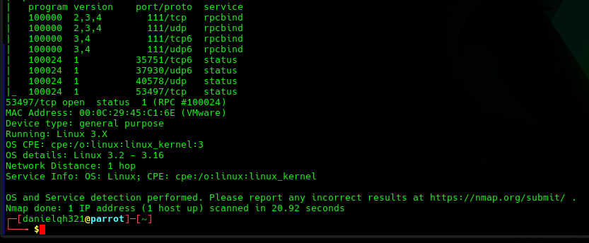

# EV-DQH-003 · Nmap de Daniel segunda parte

Autor: DQH. Instancia: LAB-DQH. Fecha exacta: no-registrada.
Original: `evidencias/originales/DQH/EV-DQH-003.png`. SHA-256: `0d6b249a4d5d258d1757e119d2d1a4d52eb742644a498f0abc7c642e3aff0e3f`.

53497/tcp status y cierre Nmap; MAC 00:0c:29:45:c1:6e. No muestra login SSH.

Hallazgos relacionados: Ninguno asignado.
La revisión visual del 2026-10-07 no es repetición de la prueba ni aprobación de otro integrante. Las fechas visibles con precisión parcial se conservan en el texto; no se inventan segundos o zona.

Figura y página del PDF final: pendientes. Para las incorporaciones nuevas, procedencia detallada en `evidencias/procedencia-2026-10-07.json`. EV-DQH-001 a 005 mantienen sus originales y corrigen sus descripciones anteriores equivocadas; consultar el registro de revisión.
