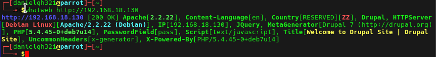

# EV-DQH-005 · WhatWeb de Daniel

Autor: DQH. Instancia: LAB-DQH. Fecha exacta: no-registrada.
Original: `evidencias/originales/DQH/EV-DQH-005.png`. SHA-256: `575561e2914fc7701eb88a50afefcfbfd52ca460fa4cd2187be400c4335e049d`.

Fingerprinting Apache/Drupal/PHP. No muestra root ni bandera final.

Hallazgos relacionados: Ninguno asignado.
La revisión visual del 2026-10-07 no es repetición de la prueba ni aprobación de otro integrante. Las fechas visibles con precisión parcial se conservan en el texto; no se inventan segundos o zona.

Figura y página del PDF final: pendientes. Para las incorporaciones nuevas, procedencia detallada en `evidencias/procedencia-2026-10-07.json`. EV-DQH-001 a 005 mantienen sus originales y corrigen sus descripciones anteriores equivocadas; consultar el registro de revisión.
