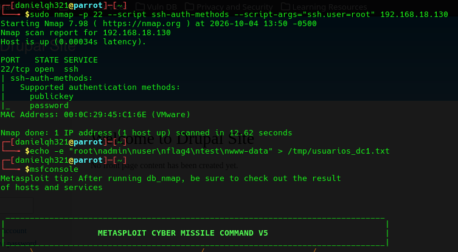

# EV-DQH-006 · Métodos de autenticación SSH

Autor: DQH. Instancia: LAB-DQH. Fecha exacta: no-registrada.
Original: `evidencias/originales/DQH/EV-DQH-006.png`. SHA-256: `371ca7f6d4c0b7c30836a979383e52ae4d3bd81921ae2082652b69bc766ea056`.

Nmap anuncia publickey y password; inicio 2026-10-04 13:50 -0500, precisión de minuto. No muestra usuario válido por enumeración.

Hallazgos relacionados: PT-007.
La revisión visual del 2026-10-07 no es repetición de la prueba ni aprobación de otro integrante. Las fechas visibles con precisión parcial se conservan en el texto; no se inventan segundos o zona.

Figura y página del PDF final: pendientes. Para las incorporaciones nuevas, procedencia detallada en `evidencias/procedencia-2026-10-07.json`. EV-DQH-001 a 005 mantienen sus originales y corrigen sus descripciones anteriores equivocadas; consultar el registro de revisión.
