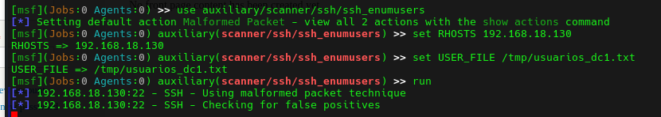

# EV-DQH-007 · Enumeración SSH iniciada

Autor: DQH. Instancia: LAB-DQH. Fecha exacta: no-registrada.
Original: `evidencias/originales/DQH/EV-DQH-007.png`. SHA-256: `dc194a62e7c0b6508fefd57f624031734c50809ac4cc15c3a19e6ba7ffc08396`.

Metasploit muestra Checking for false positives. No hay resultado final que confirme usuarios.

Hallazgos relacionados: PT-007.
La revisión visual del 2026-10-07 no es repetición de la prueba ni aprobación de otro integrante. Las fechas visibles con precisión parcial se conservan en el texto; no se inventan segundos o zona.

Figura y página del PDF final: pendientes. Para las incorporaciones nuevas, procedencia detallada en `evidencias/procedencia-2026-10-07.json`. EV-DQH-001 a 005 mantienen sus originales y corrigen sus descripciones anteriores equivocadas; consultar el registro de revisión.
