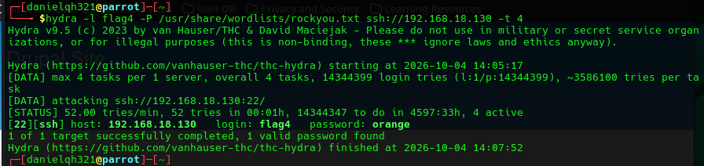

# EV-DQH-008 · Hydra encuentra credencial

Autor: DQH. Instancia: LAB-DQH. Fecha exacta: no-registrada.
Original: `evidencias/originales/DQH/EV-DQH-008.png`. SHA-256: `91fe81bfa3a5019159d51d39e59bcfb702e9a826a6e3ddd80c08f49de0d574f3`.

Hydra muestra login flag4 y contraseña encontrada. Inicio 2026-10-04 14:05:17, final 14:07:52 sin zona visible: 2 min 35 s, no segundos.

Hallazgos relacionados: PT-007.
La revisión visual del 2026-10-07 no es repetición de la prueba ni aprobación de otro integrante. Las fechas visibles con precisión parcial se conservan en el texto; no se inventan segundos o zona.

Figura y página del PDF final: pendientes. Para las incorporaciones nuevas, procedencia detallada en `evidencias/procedencia-2026-10-07.json`. EV-DQH-001 a 005 mantienen sus originales y corrigen sus descripciones anteriores equivocadas; consultar el registro de revisión.
