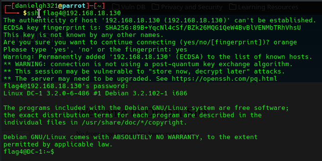

# EV-DQH-009 · Acceso SSH como flag4

Autor: DQH. Instancia: LAB-DQH. Fecha exacta: no-registrada.
Original: `evidencias/originales/DQH/EV-DQH-009.png`. SHA-256: `459aff52700d1104877bca14bcd4ed28c23c0e141dd3c14d848ba06d2b09450a`.

ssh flag4@192.168.18.130 y prompt flag4@DC-1. La advertencia de fingerprint precede al login; no prueba ausencia de verificación fuera de captura.

Hallazgos relacionados: PT-007.
La revisión visual del 2026-10-07 no es repetición de la prueba ni aprobación de otro integrante. Las fechas visibles con precisión parcial se conservan en el texto; no se inventan segundos o zona.

Figura y página del PDF final: pendientes. Para las incorporaciones nuevas, procedencia detallada en `evidencias/procedencia-2026-10-07.json`. EV-DQH-001 a 005 mantienen sus originales y corrigen sus descripciones anteriores equivocadas; consultar el registro de revisión.
