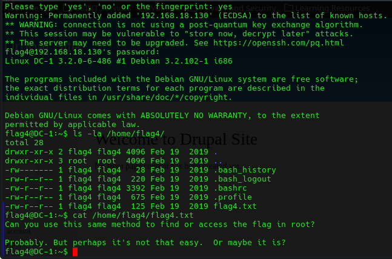

# EV-DQH-010 · Lectura de flag4

Autor: DQH. Instancia: LAB-DQH. Fecha exacta: no-registrada.
Original: `evidencias/originales/DQH/EV-DQH-010.png`. SHA-256: `d38617b1ce34465984dec1c541523359ebf501b1829809530339defc68cfa5d7`.

Sesión flag4@DC-1, listado de home y lectura de flag4.txt.

Hallazgos relacionados: PT-007.
La revisión visual del 2026-10-07 no es repetición de la prueba ni aprobación de otro integrante. Las fechas visibles con precisión parcial se conservan en el texto; no se inventan segundos o zona.

Figura y página del PDF final: pendientes. Para las incorporaciones nuevas, procedencia detallada en `evidencias/procedencia-2026-10-07.json`. EV-DQH-001 a 005 mantienen sus originales y corrigen sus descripciones anteriores equivocadas; consultar el registro de revisión.
