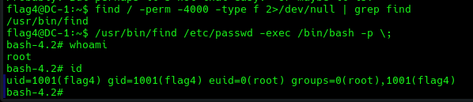

# EV-DQH-011 · SUID find y EUID root

Autor: DQH. Instancia: LAB-DQH. Fecha exacta: no-registrada.
Original: `evidencias/originales/DQH/EV-DQH-011.png`. SHA-256: `be0cc341fe289c2f62a47fe7ee1ac8604c48c35f3555b16320032745add107e4`.

find SUID seguido de bash -p, whoami root e id uid=1001(flag4), euid=0(root). UID real no cambia a cero.

Hallazgos relacionados: PT-008.
La revisión visual del 2026-10-07 no es repetición de la prueba ni aprobación de otro integrante. Las fechas visibles con precisión parcial se conservan en el texto; no se inventan segundos o zona.

Figura y página del PDF final: pendientes. Para las incorporaciones nuevas, procedencia detallada en `evidencias/procedencia-2026-10-07.json`. EV-DQH-001 a 005 mantienen sus originales y corrigen sus descripciones anteriores equivocadas; consultar el registro de revisión.
