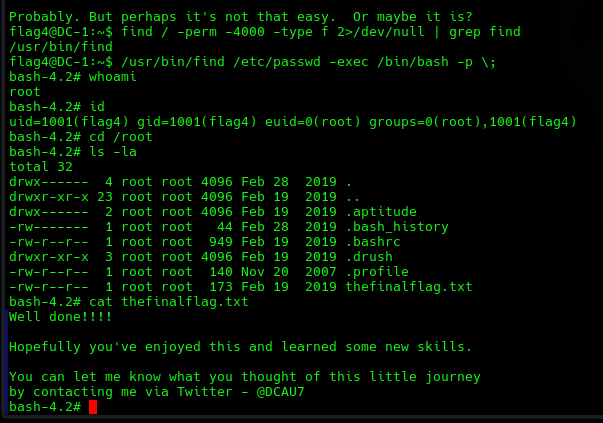

# EV-DQH-012 · EUID root y bandera final

Autor: DQH. Instancia: LAB-DQH. Fecha exacta: no-registrada.
Original: `evidencias/originales/DQH/EV-DQH-012.png`. SHA-256: `f6d07ecae895ac050396cf4c5b61c197ccd056273921c7d357a6160c21e98efd`.

Misma secuencia visible con id y lectura /root/thefinalflag.txt. Hostname solo en prompt inicial: conviene captura final explícita de hostname.

Hallazgos relacionados: PT-008.
La revisión visual del 2026-10-07 no es repetición de la prueba ni aprobación de otro integrante. Las fechas visibles con precisión parcial se conservan en el texto; no se inventan segundos o zona.

Figura y página del PDF final: pendientes. Para las incorporaciones nuevas, procedencia detallada en `evidencias/procedencia-2026-10-07.json`. EV-DQH-001 a 005 mantienen sus originales y corrigen sus descripciones anteriores equivocadas; consultar el registro de revisión.
