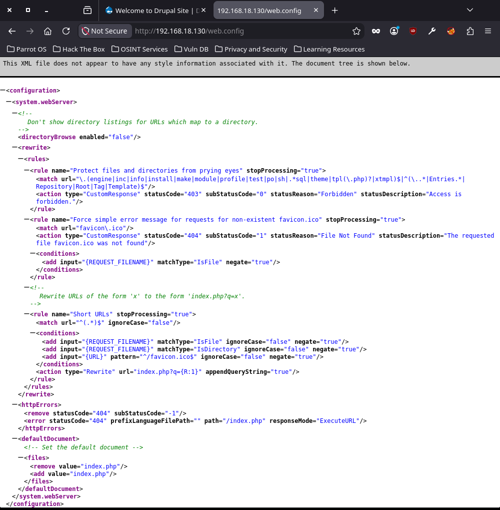

# EV-DQH-013 · Contenido web.config

Autor: DQH. Instancia: LAB-DQH. Fecha exacta: no-registrada.
Original: `evidencias/originales/DQH/EV-DQH-013.png`. SHA-256: `0d5cc2733eee1e1e9d7b80bef0931b66afdf8648e521fd1fc622cec7ac7fa153`.

Navegador muestra reglas XML de configuración. No se observan secretos ni se demuestra impacto de seguridad específico.

Hallazgos relacionados: PT-006.
La revisión visual del 2026-10-07 no es repetición de la prueba ni aprobación de otro integrante. Las fechas visibles con precisión parcial se conservan en el texto; no se inventan segundos o zona.

Figura y página del PDF final: pendientes. Para las incorporaciones nuevas, procedencia detallada en `evidencias/procedencia-2026-10-07.json`. EV-DQH-001 a 005 mantienen sus originales y corrigen sus descripciones anteriores equivocadas; consultar el registro de revisión.
