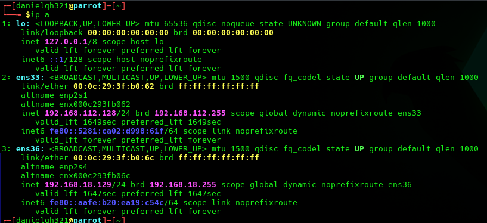

# EV-DQH-014 · Interfaces de Daniel

Autor: DQH. Instancia: LAB-DQH. Fecha exacta: no-registrada.
Original: `evidencias/originales/DQH/EV-DQH-014.png`. SHA-256: `f4361227d46ddafc68284062034240a42ecd4b3e0e78783743ac02b764a543d6`.

ens36 192.168.18.129/24 y ens33 192.168.112.128/24. MAC objetivo .18.130 difiere de Jaime: no confundir instancias por IP repetida.

Hallazgos relacionados: Ninguno asignado.
La revisión visual del 2026-10-07 no es repetición de la prueba ni aprobación de otro integrante. Las fechas visibles con precisión parcial se conservan en el texto; no se inventan segundos o zona.

Figura y página del PDF final: pendientes. Para las incorporaciones nuevas, procedencia detallada en `evidencias/procedencia-2026-10-07.json`. EV-DQH-001 a 005 mantienen sus originales y corrigen sus descripciones anteriores equivocadas; consultar el registro de revisión.
