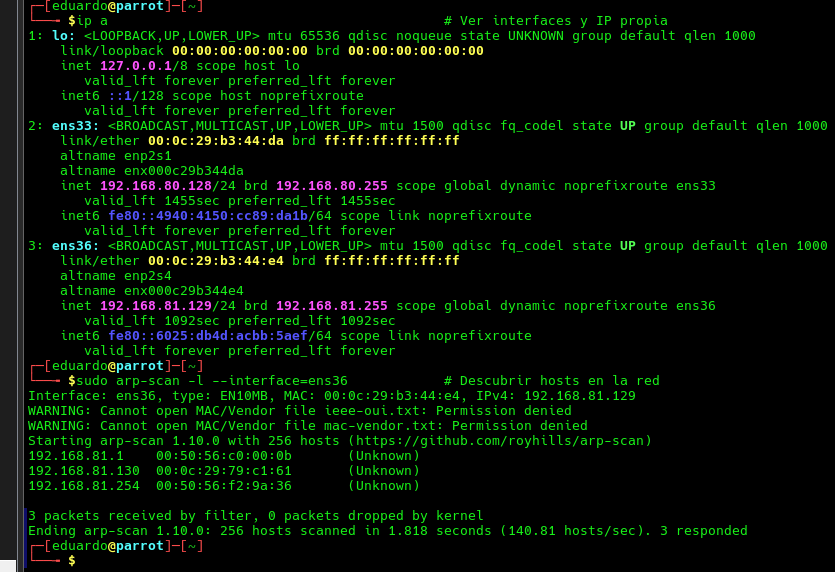

# EV-EJVA-002 · Interfaces y descubrimiento ARP

- Autor atribuido por el equipo: EJVA.
- Instancia documental: LAB-EJVA; no implica que las dos VMs sean la misma sesión.
- Fecha de prueba: no-registrada. La fecha de integración 2026-10-03 no sustituye la de ejecución.
- Origen: `cherrytree/respaldos/2026-10-03-antes-integracion/WriteUp_Basic_Pentesting1--parcial1EDuardo.ctb`, nodo 3, offset 288.
- Original extraído: `evidencias/originales/EJVA/EV-EJVA-002.png`. SHA-256: `d2d00039a36cb1d1e80a23e96822537e894e03a0a155bb343458d5b9e65278f8`.
- Comando/acción visible: ip a; sudo arp-scan -l --interface=ens36 (acciones visibles, ejecutadas por separado)

## Resultado observado

Atacante ens33 192.168.80.128/24 y ens36 192.168.81.129/24. Responden .1, .130 y .254 en 192.168.81.0/24; .130 tiene MAC 00:0c:29:79:c1:61. Hay advertencias de permisos sobre archivos de fabricantes.

## Interpretación y límites

La advertencia no impidió recibir respuestas. Falta captura del hipervisor que confirme aislamiento; dos interfaces no prueban Bridge ni Host-Only.

Figura y página del PDF final: pendientes. Validación técnica por otro integrante: pendiente. La revisión visual documental no equivale a repetición de la prueba.
