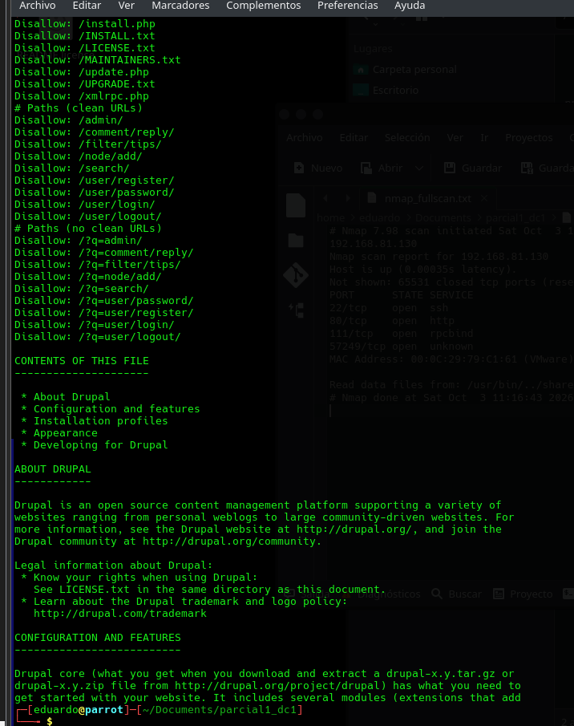

# EV-EJVA-010 · Contenido de README

- Autor atribuido por el equipo: EJVA.
- Instancia documental: LAB-EJVA; no implica que las dos VMs sean la misma sesión.
- Fecha de prueba: no-registrada. La fecha de integración 2026-10-03 no sustituye la de ejecución.
- Origen: `cherrytree/respaldos/2026-10-03-antes-integracion/WriteUp_Basic_Pentesting1--parcial1EDuardo.ctb`, nodo 3, offset 1106.
- Original extraído: `evidencias/originales/EJVA/EV-EJVA-010.png`. SHA-256: `8e89853bc558018f15ec929889e05454e5e3d5c7f36d1406817ed174e2e42ea4`.
- Comando/acción visible: Continuación de curl -s http://192.168.81.130/README | head -n 30.

## Resultado observado

El README describe Drupal y configuración; el fragmento no contiene una versión menor exacta.

## Interpretación y límites

Corrobora familia tecnológica sin confirmar versión menor ni vulnerabilidad. No tratar drupal-x.y.z.tar.gz como una versión real.

Figura y página del PDF final: pendientes. Validación técnica por otro integrante: pendiente. La revisión visual documental no equivale a repetición de la prueba.
