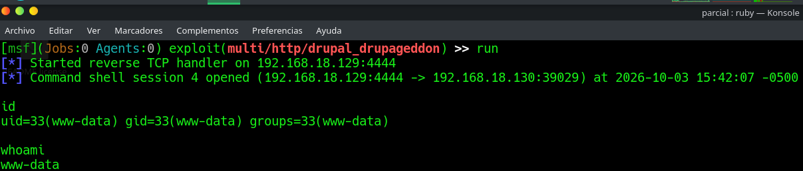

# EV-JACD-003 · Shell inicial Drupalgeddon

Autor: JACD. Instancia: LAB-JACD. Fecha exacta: no-registrada.
Original: `evidencias/originales/JACD/EV-JACD-003.png`. SHA-256: `54897a0089fede7bf799de82dc4321e0f97117f2ccf7117923bfec4bccc418f6`.

Sesión del módulo drupal_drupageddon hacia .18.130; id y whoami muestran www-data. Fecha visible: 2026-10-03 15:42:07 -0500, apertura de sesión, no hora de captura.

Hallazgos relacionados: PT-001.
La revisión visual del 2026-10-07 no es repetición de la prueba ni aprobación de otro integrante. Las fechas visibles con precisión parcial se conservan en el texto; no se inventan segundos o zona.

Figura y página del PDF final: pendientes. Para las incorporaciones nuevas, procedencia detallada en `evidencias/procedencia-2026-10-07.json`. EV-DQH-001 a 005 mantienen sus originales y corrigen sus descripciones anteriores equivocadas; consultar el registro de revisión.
