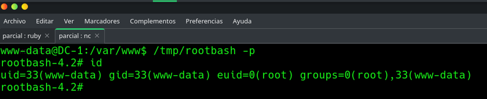

# EV-JACD-004 · Shell con EUID root

Autor: JACD. Instancia: LAB-JACD. Fecha exacta: no-registrada.
Original: `evidencias/originales/JACD/EV-JACD-004.png`. SHA-256: `814d5f8e74dfb1a7d8130907522797f50173e40aae0eba4b0f3c309ce69fbc9c`.

/tmp/rootbash -p seguido de id: uid=33(www-data), euid=0(root). Prueba privilegio efectivo; falta hostname en la misma captura.

Hallazgos relacionados: PT-002.
La revisión visual del 2026-10-07 no es repetición de la prueba ni aprobación de otro integrante. Las fechas visibles con precisión parcial se conservan en el texto; no se inventan segundos o zona.

Figura y página del PDF final: pendientes. Para las incorporaciones nuevas, procedencia detallada en `evidencias/procedencia-2026-10-07.json`. EV-DQH-001 a 005 mantienen sus originales y corrigen sus descripciones anteriores equivocadas; consultar el registro de revisión.
