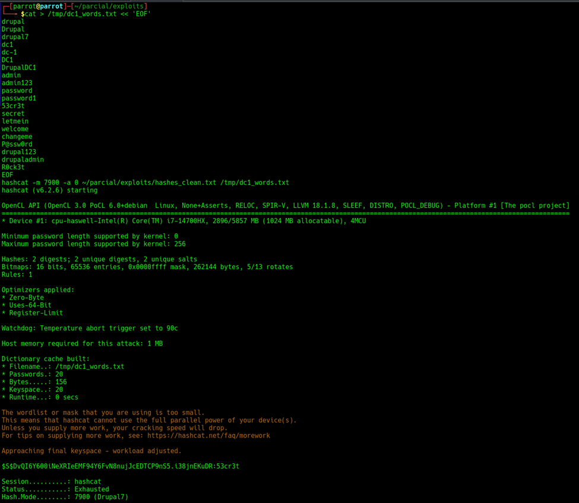

# EV-JACD-005 · Recuperación de contraseña mediante Hashcat

Autor: JACD. Instancia: LAB-JACD. Fecha exacta: no-registrada.
Original: `evidencias/originales/JACD/EV-JACD-005.png`. SHA-256: `019d621ba7879726f4e4f1d82d31a1448f1a90d7779534e0387adbdfb4f42a79`.

Hashcat modo 7900 muestra candidato recuperado; lista personalizada incluye esa misma contraseña. No demuestra debilidad intrínseca del algoritmo ni origen independiente de la lista.

Hallazgos relacionados: PT-003.
La revisión visual del 2026-10-07 no es repetición de la prueba ni aprobación de otro integrante. Las fechas visibles con precisión parcial se conservan en el texto; no se inventan segundos o zona.

Figura y página del PDF final: pendientes. Para las incorporaciones nuevas, procedencia detallada en `evidencias/procedencia-2026-10-07.json`. EV-DQH-001 a 005 mantienen sus originales y corrigen sus descripciones anteriores equivocadas; consultar el registro de revisión.
