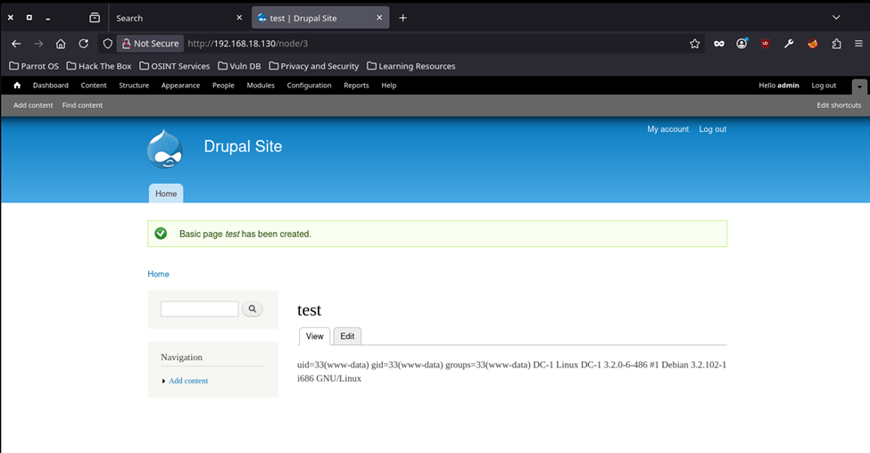

# EV-JACD-006 · Ejecución PHP desde página administrativa

Autor: JACD. Instancia: LAB-JACD. Fecha exacta: no-registrada.
Original: `evidencias/originales/JACD/EV-JACD-006.png`. SHA-256: `e37317e61b4ddd5192ce2936791cdf53b18ecac771bcbf4f215a2155bb822029`.

/node/3 muestra uid=33(www-data), hostname DC-1 y uname. Requiere sesión admin y activación previa de PHP Filter por el evaluador.

Hallazgos relacionados: PT-004.
La revisión visual del 2026-10-07 no es repetición de la prueba ni aprobación de otro integrante. Las fechas visibles con precisión parcial se conservan en el texto; no se inventan segundos o zona.

Figura y página del PDF final: pendientes. Para las incorporaciones nuevas, procedencia detallada en `evidencias/procedencia-2026-10-07.json`. EV-DQH-001 a 005 mantienen sus originales y corrigen sus descripciones anteriores equivocadas; consultar el registro de revisión.
