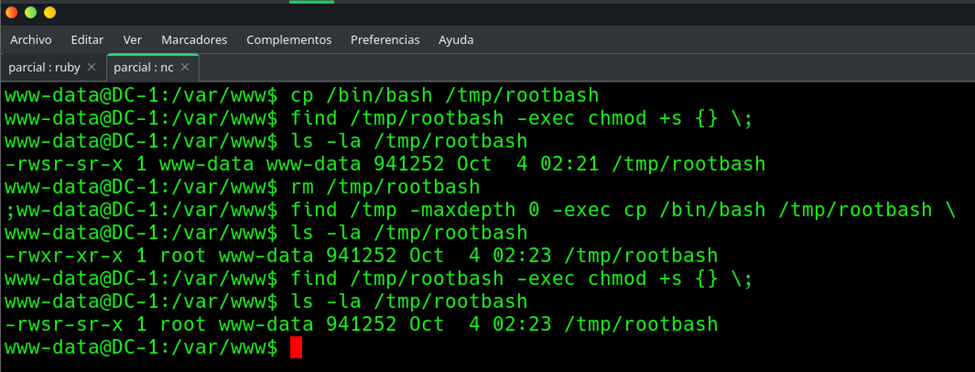

# EV-JACD-008 · Preparación de shell temporal

Autor: JACD. Instancia: LAB-JACD. Fecha exacta: no-registrada.
Original: `evidencias/originales/JACD/EV-JACD-008.png`. SHA-256: `abbe03a1311bb3ea2a2675ea39bb36e647baa82dbf09c1f2d155eae3d7dbb946`.

Secuencia desde www-data: primer archivo conserva dueño www-data; segundo creado mediante find queda root y se habilita SUID. Artefacto /tmp/rootbash debe retirarse al cerrar.

Hallazgos relacionados: PT-002.
La revisión visual del 2026-10-07 no es repetición de la prueba ni aprobación de otro integrante. Las fechas visibles con precisión parcial se conservan en el texto; no se inventan segundos o zona.

Figura y página del PDF final: pendientes. Para las incorporaciones nuevas, procedencia detallada en `evidencias/procedencia-2026-10-07.json`. EV-DQH-001 a 005 mantienen sus originales y corrigen sus descripciones anteriores equivocadas; consultar el registro de revisión.
