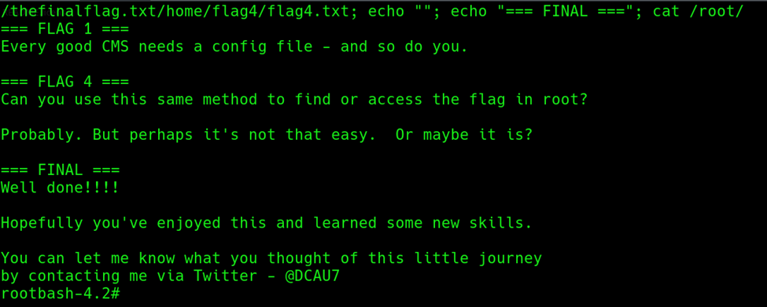

# EV-JACD-010 · Lectura de banderas

Autor: JACD. Instancia: LAB-JACD. Fecha exacta: no-registrada.
Original: `evidencias/originales/JACD/EV-JACD-010.png`. SHA-256: `b98d9eab3693f2f5acd01d4eaf94567ba29c3817faa8a3389ac7fc83aa04d06a`.

Lectura de banderas incluida la final desde rootbash. La evidencia de EUID está en EV-JACD-004; lectura de flag sola no reemplaza identidad.

Hallazgos relacionados: PT-002.
La revisión visual del 2026-10-07 no es repetición de la prueba ni aprobación de otro integrante. Las fechas visibles con precisión parcial se conservan en el texto; no se inventan segundos o zona.

Figura y página del PDF final: pendientes. Para las incorporaciones nuevas, procedencia detallada en `evidencias/procedencia-2026-10-07.json`. EV-DQH-001 a 005 mantienen sus originales y corrigen sus descripciones anteriores equivocadas; consultar el registro de revisión.
