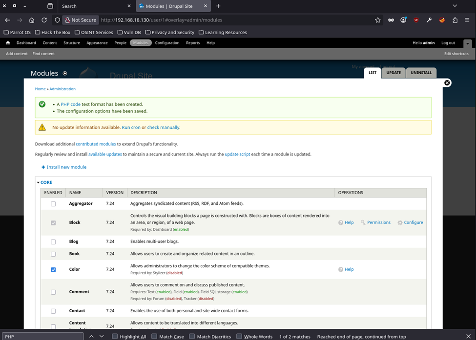

# EV-JACD-011 · Activación de PHP Filter

Autor: JACD. Instancia: LAB-JACD. Fecha exacta: no-registrada.
Original: `evidencias/originales/JACD/EV-JACD-011.png`. SHA-256: `4fd5e9201a4fa235689c585d598b52e67a6844d64dda9d0f735bfda11f9efd01`.

Mensaje de creación de formato PHP y guardado de configuración. Documenta modificación por el evaluador; no prueba que el módulo estuviera activo de origen.

Hallazgos relacionados: PT-004.
La revisión visual del 2026-10-07 no es repetición de la prueba ni aprobación de otro integrante. Las fechas visibles con precisión parcial se conservan en el texto; no se inventan segundos o zona.

Figura y página del PDF final: pendientes. Para las incorporaciones nuevas, procedencia detallada en `evidencias/procedencia-2026-10-07.json`. EV-DQH-001 a 005 mantienen sus originales y corrigen sus descripciones anteriores equivocadas; consultar el registro de revisión.
