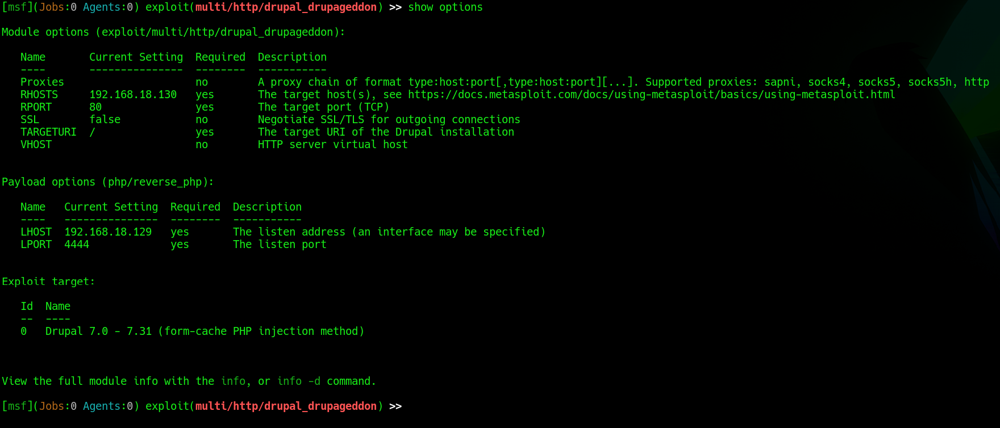

# EV-JACD-014 · Opciones de Drupalgeddon

Autor: JACD. Instancia: LAB-JACD. Fecha exacta: no-registrada.
Original: `evidencias/originales/JACD/EV-JACD-014.png`. SHA-256: `4a709d07cb8945757d44c8088bf536052a5ea43e847a1d0a632030e755561c13`.

Opciones del módulo y payload visibles. Configuración no equivale a explotación; resultado en EV-JACD-003.

Hallazgos relacionados: PT-001.
La revisión visual del 2026-10-07 no es repetición de la prueba ni aprobación de otro integrante. Las fechas visibles con precisión parcial se conservan en el texto; no se inventan segundos o zona.

Figura y página del PDF final: pendientes. Para las incorporaciones nuevas, procedencia detallada en `evidencias/procedencia-2026-10-07.json`. EV-DQH-001 a 005 mantienen sus originales y corrigen sus descripciones anteriores equivocadas; consultar el registro de revisión.
