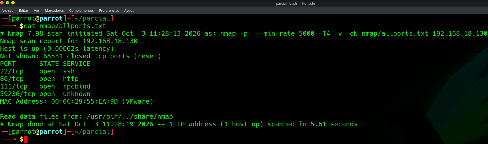

# EV-JACD-015 · Escaneo TCP completo Jaime

Autor: JACD. Instancia: LAB-JACD. Fecha exacta: no-registrada.
Original: `evidencias/originales/JACD/EV-JACD-015.png`. SHA-256: `cf74284976f6c6553245737ab03df1ddfe81fbcbfcad94afa3e23bb167d8a700`.

Nmap muestra 22/80/111/59236 TCP y MAC 00:0c:29:55:ea:9d; fecha visible 2026-10-03 11:28:13 sin zona en este archivo.

Hallazgos relacionados: Ninguno asignado.
La revisión visual del 2026-10-07 no es repetición de la prueba ni aprobación de otro integrante. Las fechas visibles con precisión parcial se conservan en el texto; no se inventan segundos o zona.

Figura y página del PDF final: pendientes. Para las incorporaciones nuevas, procedencia detallada en `evidencias/procedencia-2026-10-07.json`. EV-DQH-001 a 005 mantienen sus originales y corrigen sus descripciones anteriores equivocadas; consultar el registro de revisión.
