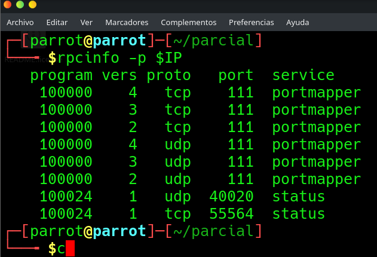

# EV-JACD-020 · Inventario RPC Jaime

Autor: JACD. Instancia: LAB-JACD. Fecha exacta: no-registrada.
Original: `evidencias/originales/JACD/EV-JACD-020.png`. SHA-256: `8f58529b6fcd4747195a11992f8311e858f1f2c9bd36115d28fb43147ced0ad9`.

rpcinfo anuncia portmapper y status, aquí 55564/tcp. No se ve showmount ni salida que confirme ausencia universal de NFS.

Hallazgos relacionados: Ninguno asignado.
La revisión visual del 2026-10-07 no es repetición de la prueba ni aprobación de otro integrante. Las fechas visibles con precisión parcial se conservan en el texto; no se inventan segundos o zona.

Figura y página del PDF final: pendientes. Para las incorporaciones nuevas, procedencia detallada en `evidencias/procedencia-2026-10-07.json`. EV-DQH-001 a 005 mantienen sus originales y corrigen sus descripciones anteriores equivocadas; consultar el registro de revisión.
