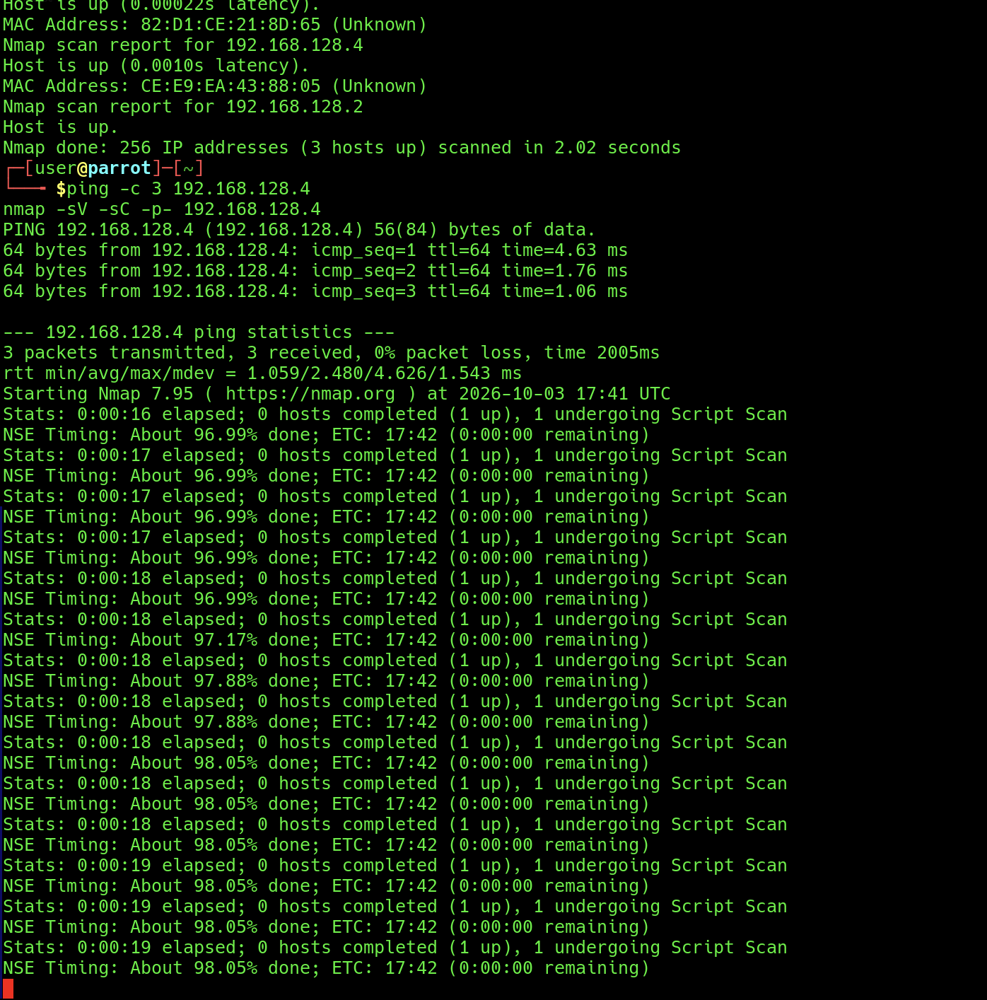

# EV-JDOG-001 · Conectividad y Nmap en curso

Autor: Juan David Ocampo Gonzalez (JDOG, 38402). Instancia documental: LAB-JDOG.
Fecha exacta de captura: no registrada. Nmap muestra inicio 2026-10-03 17:41 UTC, equivalente a 12:41 America/Bogota, sin segundos. No convertirlo en una hora precisa inventada.
Procedencia: imagen adjunta por Juan en el chat, copiada byte a byte. SHA-256: `7edb6c362072115f3ddb8f951554b4d0a290f93e13f9c5d13ad651796bc2e405`.

## Observado

Juan indica que configuró la VM en UTM y prueba desde Parrot. La captura muestra un descubrimiento previo de 256 direcciones con 3 hosts activos, pero el comando y la IP de uno de ellos no se ven completos. Se ve 192.168.128.4 con MAC CE:E9:EA:43:88:05 y también 192.168.128.2, cuyo rol no está identificado. No se deduce la IP atacante de esta imagen.

El comando ping -c 3 192.168.128.4 recibió 3 respuestas, 0% de pérdida, TTL 64 y RTT promedio 2.480 ms. Esto acredita conectividad; no confirma sistema operativo ni identidad DC-1.

Se ve nmap -sV -sC -p- 192.168.128.4. Nmap 7.95 inicia el 2026-10-03 a las 17:41 UTC (12:41 en Colombia), con precisión de minuto. La captura termina durante Script Scan, aproximadamente 98.05%, a los 19 segundos. No muestra el resultado final ni la tabla de puertos. El progreso varía; no hay evidencia de bloqueo en este fragmento. No se ve opción de salida a archivo.

## Interpretación y límites

Estado: conectividad observada y escaneo en curso al capturar. Objetivo candidato 192.168.128.4; falta vincular su MAC con el adaptador de DC-1 en UTM, evidenciar aislamiento y obtener la salida final. UTM/Parrot son información aportada por Juan, no configuración comprobada por esta imagen. No trasladar puertos ni versiones de LAB-JACD o LAB-EJVA a LAB-JDOG. Sin vulnerabilidades confirmadas.

Figura/página final y revisión cruzada: pendientes. La imagen alta requerirá maquetación legible; conservar el original y obtener una captura compacta de la salida final.
