# Informe de pentest · MnzHack · DC-1

BORRADOR DE TRABAJO. Reconocimiento y enumeración iniciales incorporados desde los cuadernos; sin vulnerabilidades confirmadas. Esta fuente no es el PDF de entrega.

## 01. Portada

**MnzHack · DC-1 · Seguridad Informática**

Juan David Ocampo Gonzalez — 38402

Jaime Andres Cardona Diaz — 40549

Daniel Quintero Hurtado — 31429

Eduardo Jose Villamil Arce — 37831

Periodo: 3–8 octubre 2026. PENDIENTE: institución/docente, nombre de equipo aclarado y fecha final.

## 02. Control documental

Versión 0.1 · Borrador estructural · 2026-10-03. PENDIENTE: autores de cambios, revisor y aprobación interna.

## 03. Tabla de contenido

PENDIENTE: generar al maquetar; verificar títulos y páginas contra el PDF final.

## 04. Resumen ejecutivo

PENDIENTE: objetivo, alcance, resultado demostrado, riesgos prioritarios, impacto y acciones principales para lector no técnico. Redactar al consolidar las pruebas.

## 05. Objetivos

Determinar si un atacante con acceso a la misma red puede comprometer DC-1 y alcanzar privilegios administrativos, documentando descubrimiento, validación, impacto y remediación.

## 06. Alcance

PENDIENTE: datos reales de docs/02-alcance-roe.md, modalidad y justificación.

## 07. Exclusiones

Excluidos otros grupos, equipos personales, redes institucionales e Internet público.

## 08. Rules of Engagement

Pruebas controladas solo en DC-1 aislada; sin DoS, borrado, persistencia permanente ni pivoteo. PENDIENTE: reglas operativas, parada y manejo de evidencia acordados.

## 09. Metodología PTES

PTES: Pre-Engagement, Intelligence Gathering, Threat Modeling, Vulnerability Analysis, Exploitation, Post-Exploitation y Reporting. PENDIENTE: explicar cómo se aplicó cada fase y sus límites.

## 10. Arquitectura del laboratorio

Se registran dos instancias documentales: LAB-JACD (atacante 192.168.18.129, ens36; objetivo 192.168.18.130) y LAB-EJVA (atacante 192.168.81.129/24, ens36; objetivo 192.168.81.130). Eduardo muestra además ens33 192.168.80.128/24. Jaime declara Host-Only VMnet11; falta captura de configuración para verificar aislamiento.

PENDIENTE: diagrama del laboratorio, snapshots, identidad de las copias y verificación del modo de red. No presentar ambas IP como el mismo host en una única sesión.

## 11. Reconocimiento e Intelligence Gathering

Jaime documentó descubrimiento ARP y ping, con tres respuestas y 0% de pérdida hacia 192.168.18.130 (EV-JACD-001/002). TTL 64 no confirma por sí solo Linux. Eduardo documentó interfaces y descubrimiento de 192.168.81.130, MAC 00:0c:29:79:c1:61 (EV-EJVA-002).

Nmap 7.98 mostró 22, 80, 111 y 57249/tcp abiertos en LAB-EJVA; 65531 puertos TCP cerrados (EV-EJVA-003/004). El escaneo de servicios identifica SSH, HTTP, rpcbind y status RPC (EV-EJVA-005). No se acredita escaneo UDP independiente. Jaime declara 22/80/111/59236; PENDIENTE adjuntar su Nmap antes de afirmar estos resultados como comprobados.

Las capturas se incluyen en el anexo de esta fuente; numeración final y legibilidad del PDF pendientes.

## 12. Enumeración

En LAB-EJVA, Nmap reporta OpenSSH 6.0p1 Debian 4+deb7u7, Apache 2.2.22 Debian, Drupal 7, rpcbind 2–4 y status 1 en 57249/tcp. WhatWeb coincide en Apache/Drupal y reporta PHP 5.4.45-0+deb7u14. Estos banners requieren validación antes de asociar vulnerabilidades.

Gobuster v3.6 encontró respuestas 200, 301 y 403; las consultas HTTP muestran robots.txt, README, web.config y una respuesta de xmlrpc.php que acepta POST. Las rutas no demuestran por sí mismas exposición sensible ni ejecución remota. El fragmento README no acredita versión menor de Drupal. La línea de WordPress/WPScan no tiene resultado y no coincide con el CMS observado.

PENDIENTE: recuperar salidas originales, caracterizar cada servicio y formular hipótesis verificables. Conservar errores visibles: URL como comando de shell y head con argumento 30~.

## 13. Threat Modeling

Modelo preliminar basado en LAB-EJVA; no equivale a hallazgos confirmados.

| Superficie | Evidencia | Hipótesis a investigar | Prioridad propuesta |
|---|---|---|---|
| HTTP / aplicación identificada como Drupal | EV-EJVA-005 a 011 | Comportamientos o versiones que requieran validación técnica | Alta por amplitud de superficie observada |
| SSH | EV-EJVA-005 | Configuración y autenticación que ameriten pruebas dentro del alcance | Media |
| RPC | EV-EJVA-005 | Programas expuestos y necesidad de exposición | Media |

PENDIENTE: activos/impacto del escenario, precondiciones, TEST y criterios de aceptación. No asignar CVE o exploit antes de investigación y validación propias.

## 14. Análisis de vulnerabilidades

La revisión incorpora observaciones de enumeración. No hay vulnerabilidad específica confirmada ni severidad/CVSS asignados. Versiones y rutas constituyen entradas para la investigación; ninguna salida automática demuestra por sí sola explotabilidad.

PENDIENTE: validación de hipótesis, fuentes técnicas, controles y documentación de falsos positivos.

## 15. Resumen de hallazgos

No hay fichas PT confirmadas en esta revisión. Los resultados de puertos y tecnologías se documentan como observaciones en los apartados 11–14. PENDIENTE: incorporar hallazgos específicos una vez investigados y validados.

## 16. Explotación

PENDIENTE: redactar con resultados propios, EV/PT, figuras numeradas e interpretación. Explicar cobertura y limitaciones sin inventar resultados.

## 17. Post-Exploitation

PENDIENTE: redactar con resultados propios, EV/PT, figuras numeradas e interpretación. Explicar cobertura y limitaciones sin inventar resultados.

## 18. Escalamiento de privilegios

PENDIENTE: redactar con resultados propios, EV/PT, figuras numeradas e interpretación. Explicar cobertura y limitaciones sin inventar resultados.

## 19. Cadena de ataque

PENDIENTE: diagrama propio con secuencia realmente ejecutada, IDs EV/PT y privilegios en cada transición. Si una transición no se logró, mostrar el límite, no completar la cadena por suposición.

## 20. Hallazgos técnicos detallados

PENDIENTE: incorporar fichas completas desde hallazgos/PT-NNN.md y sus figuras; no entregar solo enlaces a Markdown.

## 21. Proof of Compromise

PENDIENTE: evidencia final de usuario, privilegios y hostname; explicar máximo acceso demostrado si no se obtuvo root.

## 22. Recomendaciones

PENDIENTE: tabla PT | acción concreta | prioridad | responsable sugerido | comprobación. Distinguir recomendaciones de correcciones realmente aplicadas.

## 23. Conclusiones

PENDIENTE: redactar con resultados propios, EV/PT, figuras numeradas e interpretación. Explicar cobertura y limitaciones sin inventar resultados.

## 24. Referencias

PENDIENTE: título, autor/organismo, URL, consulta y propósito. Usar fuentes técnicas primarias; no walkthroughs de DC-1.

## 25. Anexos técnicos

Evidencias recibidas: copias PNG extraídas sin modificar de los cuadernos. Los identificadores EV se conservan; PENDIENTE numeración de figuras y páginas finales. Fechas exactas no sustentadas se mantienen como no registradas. No se recibieron salidas TXT originales.

### EV-JACD-001 · Descubrimiento ARP

Instancia: LAB-JACD. Autor: JACD. Fecha: no-registrada.

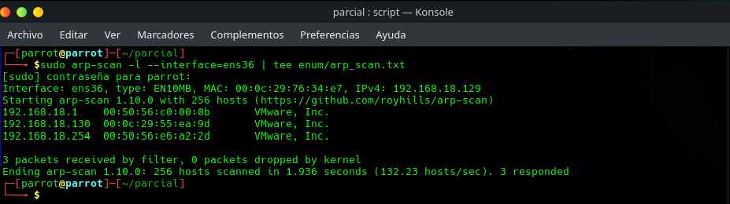

**Acción:** sudo arp-scan -l --interface=ens36 | tee enum/arp_scan.txt

**Observado:** Se observa ens36 con IP atacante 192.168.18.129; responden 192.168.18.1, .130 y .254. La MAC de .130 es 00:0c:29:55:ea:9d.

**Interpretación y límites:** La captura acredita respuestas ARP. La asignación de .130 a DC-1 y los roles de .1/.254 proceden de las notas de Jaime; la captura sola no acredita esos roles ni el modo Host-Only.

### EV-JACD-002 · Conectividad ICMP

Instancia: LAB-JACD. Autor: JACD. Fecha: no-registrada.

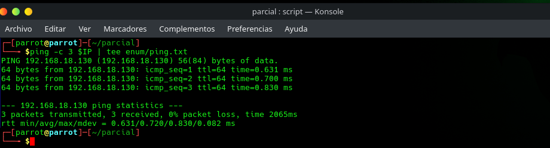

**Acción:** ping -c 3 $IP | tee enum/ping.txt

**Observado:** La variable IP se resuelve a 192.168.18.130: 3 paquetes recibidos, 0% de pérdida y TTL 64.

**Interpretación y límites:** Conectividad observada en esta sesión. TTL 64 es un indicio, no confirmación del sistema operativo; falta evidencia de consola mencionada en las notas.

### EV-EJVA-001 · Pantalla de arranque

Instancia: LAB-EJVA. Autor: EJVA. Fecha: no-registrada.

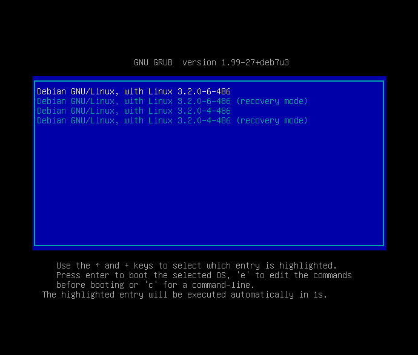

**Acción:** Observación de consola de la VM; no hay comando de terminal en esta captura.

**Observado:** Menú GNU GRUB con entrada Debian GNU/Linux y Linux 3.2.0-4-486.

**Interpretación y límites:** Indicio del sistema configurado para arrancar. No prueba la versión efectivamente ejecutada ni vincula por sí sola esta consola a 192.168.81.130.

### EV-EJVA-002 · Interfaces y descubrimiento ARP

Instancia: LAB-EJVA. Autor: EJVA. Fecha: no-registrada.

**Acción:** ip a; sudo arp-scan -l --interface=ens36 (acciones visibles, ejecutadas por separado)

**Observado:** Atacante ens33 192.168.80.128/24 y ens36 192.168.81.129/24. Responden .1, .130 y .254 en 192.168.81.0/24; .130 tiene MAC 00:0c:29:79:c1:61. Hay advertencias de permisos sobre archivos de fabricantes.

**Interpretación y límites:** La advertencia no impidió recibir respuestas. Falta captura del hipervisor que confirme aislamiento; dos interfaces no prueban Bridge ni Host-Only.

### EV-EJVA-003 · Descubrimiento y escaneo TCP completo

Instancia: LAB-EJVA. Autor: EJVA. Fecha: no-registrada.

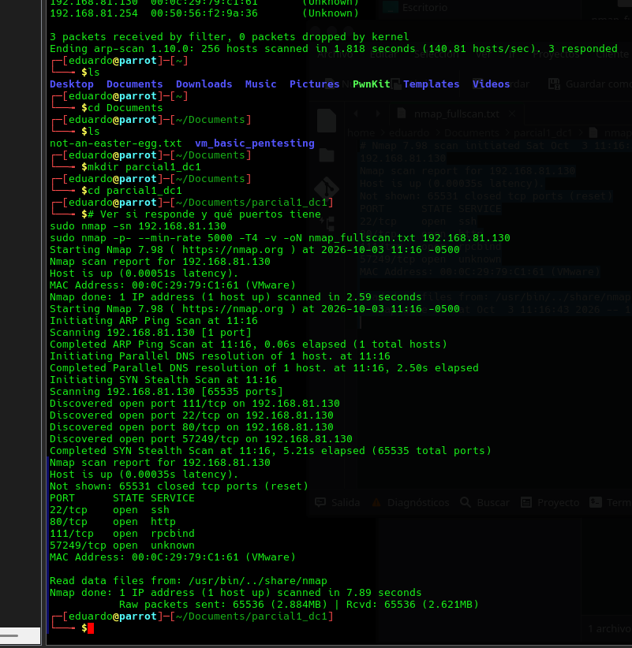

**Acción:** sudo nmap -sn 192.168.81.130; sudo nmap -p- --min-rate 5000 -T4 -v -oN nmap_fullscan.txt 192.168.81.130 (dos ejecuciones)

**Observado:** Nmap 7.98 muestra host activo y puertos TCP 22, 80, 111 y 57249 abiertos; 65531 cerrados. Hora visible de inicio: 2026-10-03 11:16 -0500, sin segundos en esta captura.

**Interpretación y límites:** Superficie TCP observada, no vulnerabilidades. 57249 aparece todavía unknown en este escaneo; el escaneo de servicios posterior lo identifica. No demuestra cobertura UDP.

### EV-EJVA-004 · Salida guardada del escaneo TCP

Instancia: LAB-EJVA. Autor: EJVA. Fecha: 2026-10-03T11:16:35-05:00.

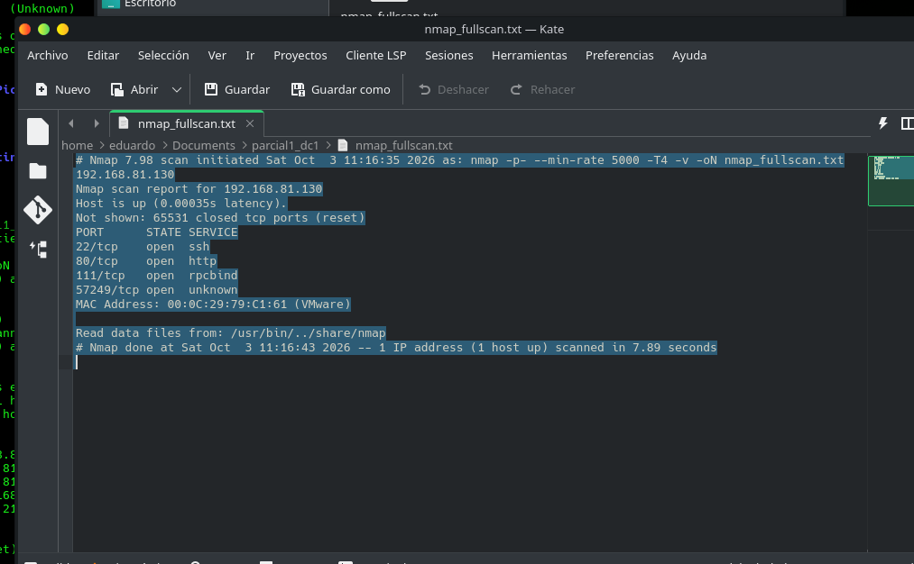

**Acción:** Vista de nmap_fullscan.txt en Kate; el encabezado conserva la invocación de Nmap.

**Observado:** Mismo objetivo y cuatro puertos. Encabezado: Sat Oct 3 11:16:35 2026; finaliza 11:16:43.

**Interpretación y límites:** Respalda la captura anterior. Se extrajo la imagen, no el archivo nmap_fullscan.txt original. Zona -05:00 tomada del escaneo relacionado; reloj del laboratorio no verificado.

### EV-EJVA-005 · Servicios y versiones Nmap

Instancia: LAB-EJVA. Autor: EJVA. Fecha: no-registrada.

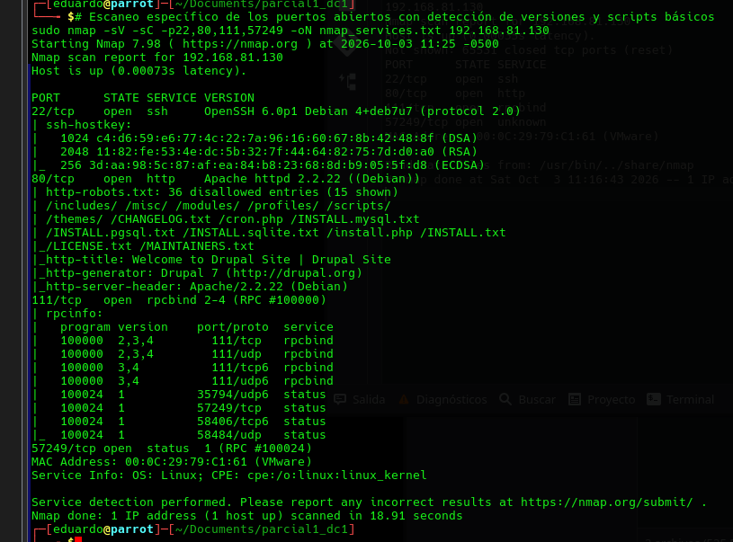

**Acción:** sudo nmap -sV -sC -p22,80,111,57249 -oN nmap_services.txt 192.168.81.130

**Observado:** Nmap 7.98: 22/tcp OpenSSH 6.0p1 Debian 4+deb7u7; 80/tcp Apache httpd 2.2.22 Debian, generador Drupal 7; 111/tcp rpcbind 2-4; 57249/tcp status 1, RPC #100024. Inicio visible 2026-10-03 11:25 -0500 sin segundos.

**Interpretación y límites:** Versiones reportadas por fingerprinting; no demuestran exploit ni parche ausente. rpcinfo enumera puertos UDP, pero esto no sustituye escaneo UDP. El comando no incluye -O.

### EV-EJVA-006 · Gobuster y error al invocar URL

Instancia: LAB-EJVA. Autor: EJVA. Fecha: no-registrada.

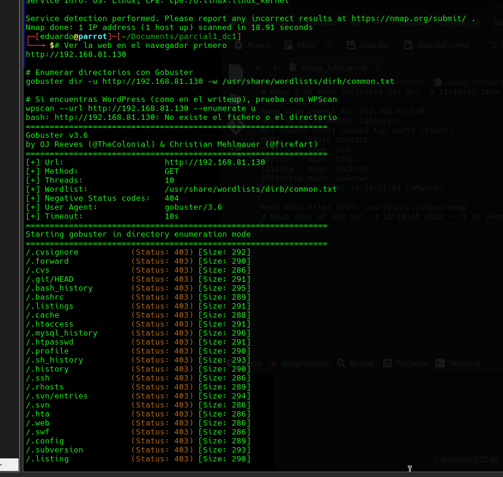

**Acción:** gobuster dir -u http://192.168.81.130 -w /usr/share/wordlists/dirb/common.txt

**Observado:** Gobuster v3.6 inicia y devuelve varias rutas con 403. También aparece error de Bash por introducir una URL directamente en terminal. Hay una línea de WPScan sin resultado visible.

**Interpretación y límites:** La URL debe abrirse en navegador o cliente HTTP; el error no es del servicio. No afirmar que WPScan se completó ni que hay WordPress. 403 no demuestra archivo accesible ni existencia inequívoca.

### EV-EJVA-007 · Resultados de enumeración de rutas

Instancia: LAB-EJVA. Autor: EJVA. Fecha: no-registrada.

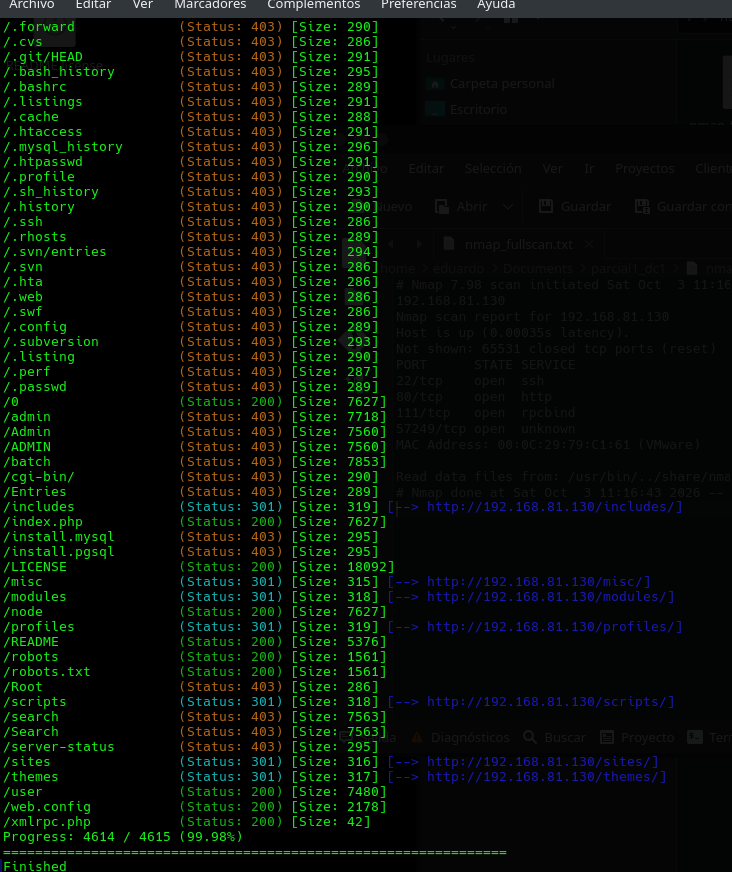

**Acción:** Continuación del mismo Gobuster de EV-EJVA-006.

**Observado:** Se observan 200 en /README, /robots.txt, /web.config, /xmlrpc.php, /LICENSE y /user; 301 en varios directorios; 403 en /admin y otras rutas.

**Interpretación y límites:** Los códigos son observaciones de enumeración. No prueban por sí solos divulgación sensible, listado de directorios o acceso administrativo. Comprobar contenido y controles antes de asignar hallazgo.

### EV-EJVA-008 · Consultas HTTP y error de head

Instancia: LAB-EJVA. Autor: EJVA. Fecha: no-registrada.

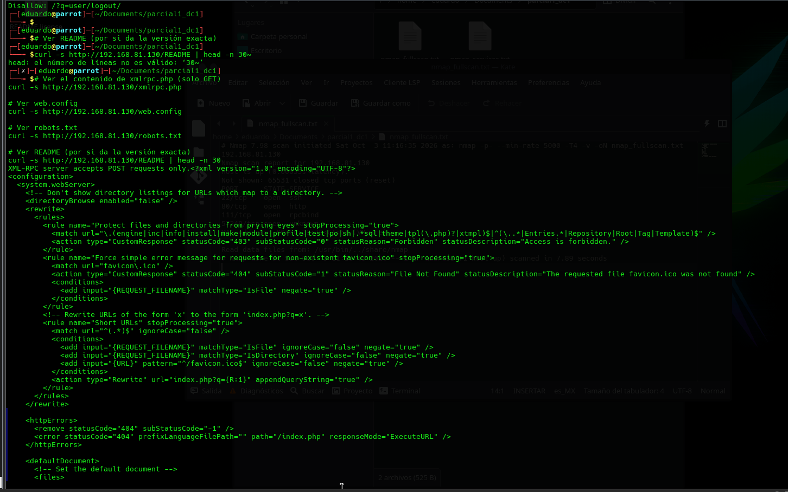

**Acción:** curl -s a /xmlrpc.php, /web.config, /robots.txt y /README; README se canaliza a head -n 30 tras un intento con 30~.

**Observado:** Se ve error por argumento 30~; luego se repite. xmlrpc.php responde que acepta POST; web.config devuelve XML.

**Interpretación y límites:** Conservar el error y su corrección. GET a xmlrpc.php no demuestra ejecución remota. Un web.config servido por Apache no demuestra IIS ni exposición de secretos.

### EV-EJVA-009 · Contenido de robots.txt

Instancia: LAB-EJVA. Autor: EJVA. Fecha: no-registrada.

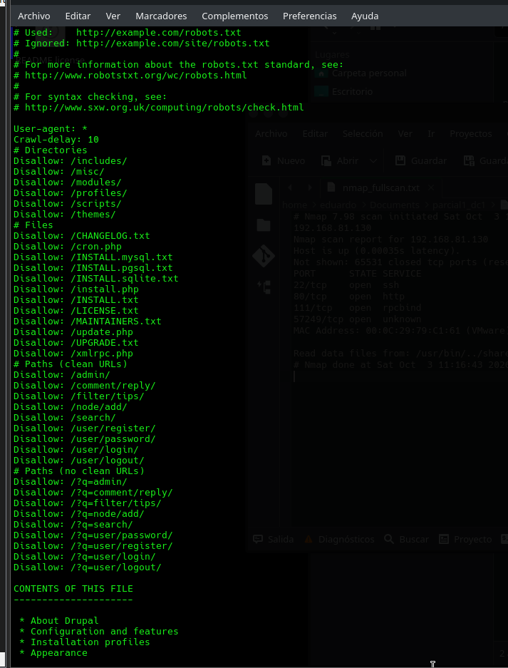

**Acción:** Continuación de las consultas curl de EV-EJVA-008.

**Observado:** robots.txt enumera rutas y reglas Disallow; aparece el comienzo del contenido README.

**Interpretación y límites:** Las reglas orientan enumeración; no equivalen a controles de acceso ni garantizan exposición de cada ruta.

### EV-EJVA-010 · Contenido de README

Instancia: LAB-EJVA. Autor: EJVA. Fecha: no-registrada.

**Acción:** Continuación de curl -s http://192.168.81.130/README | head -n 30.

**Observado:** El README describe Drupal y configuración; el fragmento no contiene una versión menor exacta.

**Interpretación y límites:** Corrobora familia tecnológica sin confirmar versión menor ni vulnerabilidad. No tratar drupal-x.y.z.tar.gz como una versión real.

### EV-EJVA-011 · Fingerprinting WhatWeb

Instancia: LAB-EJVA. Autor: EJVA. Fecha: no-registrada.

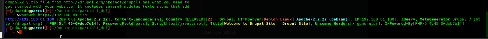

**Acción:** whatweb http://192.168.81.130

**Observado:** WhatWeb devuelve HTTP 200, Apache 2.2.22, Drupal 7 y PHP 5.4.45-0+deb7u14 entre sus identificadores.

**Interpretación y límites:** Fingerprinting consistente con Nmap para HTTP. Versiones reportadas, no validación de CVE; registrar versión de WhatWeb y obtener respuesta original si se conserva.
