# Informe de pentest · MnzHack · DC-1

Versión 0.5 para revisión del equipo, 8 de octubre de 2026. Resultados respaldados por capturas; se declaran las limitaciones de evidencia y la revisión humana pendiente. Documento académico de distribución restringida al equipo y al docente.

## 01. Portada

**MnzHack | DC-1 | Seguridad Informática**

Juan David Ocampo Gonzalez - 38402

Jaime Andres Cardona Diaz - 40549

Daniel Quintero Hurtado - 31429

Eduardo Jose Villamil Arce - 37831

Periodo del ejercicio: 3 al 8 de octubre de 2026. Corte documental: 8 de octubre de 2026. Metodología PTES. Informe técnico y ejecutivo de laboratorio autorizado.

Institución y docente no informados en el material recibido. Se conserva MnzHack, nombre indicado por el equipo; la tabla de asignación del docente escribe Mzlhack. Esta diferencia administrativa requiere aclaración.

## 02. Control documental

| Campo | Registro |
|---|---|
| Documento | PARCIAL_PENTEST_MnzHack_DC-1.pdf |
| Versión | 0.5 - consolidación documental del 8 de octubre de 2026 |
| Autores | Equipo MnzHack; los cuatro integrantes identificados en portada |
| Clasificación | Uso académico restringido; incluye credenciales del laboratorio deliberadamente vulnerable |
| Integridad | Originales preservados; 74 registros con SHA-256 y procedencia |
| Revisión | Corrección documental y visual realizada; revisión cruzada técnica por los integrantes pendiente |
| Historial | v0.1 reconocimiento; v0.2 consolidación y corrección de referencias; v0.5 explicación, maquetación y evaluación de cobertura |

Se distinguen cuatro niveles: **observado** en captura; **reportado** por el autor; **inferido** con explicación; **no verificado**. El estado en-validacion de una ficha puede indicar revisión cruzada pendiente aunque su resultado técnico sea visible. No se han ejecutado nuevas pruebas ni remediaciones al elaborar esta versión.

Limitaciones transversales: faltan configuración de aislamiento/snapshots, algunas marcas temporales, versión exacta de herramientas de explotación y cierre de limpieza. Las fechas parciales visibles se conservan sin inventar hora de captura. La ausencia de una salida no prueba un resultado negativo.

## 03. Tabla de contenido

El PDF incorpora un índice automático con páginas y marcadores. Los identificadores EV de las secciones técnicas conducen a las figuras del anexo; cada figura contiene su explicación y su huella de integridad.

## 04. Resumen ejecutivo

Las evidencias revisadas muestran que un atacante en la red del laboratorio puede obtener acceso al sistema y elevar su privilegio efectivo a root. El equipo documentó acceso como usuario web mediante Drupalgeddon y escalamiento por SUID find; el equipo documentó acceso SSH con una credencial débil y la misma causa de escalamiento en otra instancia. No se mezclan las sesiones ni se cuenta SUID dos veces como causa independiente.

Las prioridades de remediación son actualizar la aplicación a una plataforma soportada, corregir permisos SUID y fortalecer credenciales y privilegios administrativos. La activación de PHP Filter durante la prueba se trata como escenario condicionado a una modificación del evaluador.

Limitaciones: revisión humana de las fichas, cierre de severidades y evidencia de restauración del laboratorio no completados. Los avances posteriores reportados para 192.168.81.130 continúan reportados sin capturas nuevas.

## 05. Objetivos

Determinar si un atacante con acceso a la misma red puede comprometer DC-1 y alcanzar privilegios administrativos, documentando descubrimiento, validación, impacto y remediación.

## 06. Alcance

El activo autorizado es exclusivamente la VM DC-1 asignada. Se documentan cuatro copias de laboratorio, no cuatro servidores de una organización real. Las IP privadas identifican cada sesión y pueden cambiar al reiniciar o restaurar; se correlacionan con MAC, autor y evidencia, nunca solo con el hostname DC-1.

| Recorrido | IP objetivo | Servicio / cobertura | Evidencia base |
|---|---|---|---|
| recorrido web (estrategia 2) | 192.168.18.130 | TCP, HTTP, RPC, acceso y escalamiento local | EV-JACD-001, EV-JACD-015, EV-JACD-003, EV-JACD-004 |
| recorrido SSH (estrategia 3) | 192.168.18.130 | TCP, web, SSH y escalamiento local | EV-DQH-001, EV-DQH-002, EV-DQH-009, EV-DQH-011 |
| reconocimiento de servicios (estrategia 1) | 192.168.81.130 | Reconocimiento y enumeración evidenciados | EV-EJVA-002, EV-EJVA-005 |
| verificación en UTM (estrategia 1) | 192.168.128.4 | Candidato DC-1 en UTM; conectividad y TCP | EV-JDOG-001, EV-JDOG-002 |

Modalidad: El equipo declara en el recorrido web Black Box para el inicio sin credenciales; el nombre de la VM sí era conocido. Esta denominación describe su planteamiento inicial, no certifica desconocimiento total de todos los integrantes. La revisión posterior trabaja con evidencias compartidas. El conocimiento previo exacto y el aislamiento no están completamente documentados; no se declara una modalidad homogénea sin corroboración.

La información de usuarios, archivos, CMS y puertos se limita a estas instancias. No se comprobó UDP de forma independiente ni se cubrieron exhaustivamente todos los vectores locales.

## 07. Exclusiones

Excluidos otros grupos, equipos personales, redes institucionales e Internet público.

## 08. Rules of Engagement

Las reglas del docente autorizan descubrimiento, enumeración, investigación, explotación controlada y escalamiento únicamente en DC-1 aislada. Se debe usar Host-Only/Internal y verificar IP, MAC y adaptador antes de cada nueva sesión. Las capturas recibidas acreditan conectividad, pero no sustituyen la configuración del hipervisor.

Condiciones de parada: identidad o red dudosa; aparición de un activo ajeno; inestabilidad; efectos no previstos; o máximo privilegio suficiente para demostrar el objetivo. Tras root, limitarse a las comprobaciones y cierre acordados. No realizar DoS, borrado de datos, persistencia permanente ni pivoteo.

Tratamiento de evidencia: conservar comando y salida completa, incluidos fallos; anotar autor, instancia, fecha/zona y snapshot; guardar originales, calcular SHA-256 y generar copias distintas si se redactan secretos. Una huella verifica integridad desde su registro, no certifica autenticidad ni fecha de la prueba.

Cierre: inventariar modificaciones propias, detener listeners y retirar archivos/contenido de prueba de manera controlada o restaurar el snapshot. En esta revisión no se verificó limpieza. La ventana exacta de cada sesión, responsable de parada y snapshots usados no constan completos y deben confirmarse con los autores.

## 09. Metodología PTES

| Fase PTES | Aplicación en el ejercicio | Resultado y límite |
|---|---|---|
| Pre-Engagement | Objetivo, DC-1, límites y reglas del docente | Alcance escrito; aislamiento y snapshots sin prueba completa |
| Intelligence Gathering | ARP, ping, Nmap, HTTP y RPC | Cuatro inventarios separados; los banners son indicios |
| Threat Modeling | Priorizar aplicación, identidad y permisos locales | Hipótesis conectadas con activos en sección 13 |
| Vulnerability Analysis | Contrastar comportamiento y fuentes técnicas | Ocho fichas; se separan duplicados y casos no demostrados |
| Exploitation | Sesión web y login SSH del equipo | Acceso inicial visible; no mezclar cadenas |
| Post-Exploitation | Identidad, permisos, SUID y lectura de bandera | EUID root observado; cobertura local parcial |
| Reporting | Fichas, figuras, interpretación y remediaciones | Evidencia integrada en este PDF; aprobación cruzada pendiente |

La secuencia no se reconstruye por el orden del nombre de una imagen. Algunas capturas se tomaron después de elevar privilegios. Se conservan esas limitaciones y se separa el procedimiento descrito del orden temporal probado.

### Organización por estrategias

| Estrategia | Pregunta y recorrido | Evidencia decisiva |
|---|---|---|
| 1. Reconocimiento y priorización | ¿Qué objetivo y servicios se observan? Aportes de los cuatro integrantes, conservando IP/MAC de cada captura | ARP, Nmap, HTTP y búsquedas técnicas del anexo |
| 2. Acceso por la aplicación web | ¿Se obtiene ejecución mediante Drupal? Recorrido web del equipo con sesiones web y estabilización | EV-JACD-003, EV-JACD-024, EV-JACD-025, EV-JACD-026 |
| 3. Acceso por autenticación SSH | ¿Una credencial permite sesión de usuario? Recorrido SSH del equipo, con candidatos, Hydra y login | EV-DQH-021, EV-DQH-008, EV-DQH-009 |
| 4. Privilegios, impacto y cierre | ¿Hasta dónde llega cada acceso? SUID find, EUID root y lectura de recursos; ramas administrativas posteriores | EV-JACD-004, EV-JACD-027, EV-DQH-011, EV-DQH-012 |

Las estrategias organizan el relato. No fusionan máquinas o sesiones: las direcciones, MAC e identificadores de las figuras conservan el contexto original. Dos capturas que comparten IP no prueban continuidad de una misma VM.

## 10. Arquitectura del laboratorio

La figura de arquitectura es una reconstrucción lógica de las relaciones observadas. Las líneas representan conectividad de las pruebas; no certifican el modo del adaptador del hipervisor.

| Recorrido | Atacante | Identidad del objetivo | Aislamiento |
|---|---|---|---|
| Acceso web | 192.168.18.129, ens36 | .18.130 / 00:0c:29:55:ea:9d | Host-Only VMnet11 declarado; falta captura |
| Acceso SSH | 192.168.18.129, ens36 | .18.130 / 00:0c:29:45:c1:6e | Configuración no aportada |
| Reconocimiento de servicios | .81.129/24, ens36; también .80.128/24, ens33 | .81.130 / 00:0c:29:79:c1:61 | Configuración no aportada |
| Verificación en UTM | Parrot reportado; IP no identificada en captura | .128.4 / CE:E9:EA:43:88:05 | UTM reportado; configuración no aportada |

Aunque los recorridos web y SSH comparten IP, las MAC son distintas. No se fusionan como una misma sesión. La IP del objetivo en UTM es candidata hasta correlacionarla con la VM en UTM. No consta hash de imagen base, versión de hipervisor ni snapshot; no se inventan estos datos. Fuentes: EV-JACD-001, EV-DQH-001, EV-DQH-014, EV-EJVA-002 y EV-JDOG-001.

## 11. Reconocimiento e Intelligence Gathering

El equipo documentó descubrimiento ARP y ping, con tres respuestas y 0% de pérdida hacia 192.168.18.130 (EV-JACD-001/002). TTL 64 no confirma por sí solo Linux. El equipo documentó interfaces y descubrimiento de 192.168.81.130, MAC 00:0c:29:79:c1:61 (EV-EJVA-002).

Nmap 7.98 mostró 22, 80, 111 y 57249/tcp abiertos en reconocimiento de servicios (estrategia 1); 65531 puertos TCP cerrados (EV-EJVA-003/004). El escaneo de servicios identifica SSH, HTTP, rpcbind y status RPC (EV-EJVA-005). No se acredita escaneo UDP independiente. El equipo acredita 22/80/111/59236 con EV-JACD-015/016/017; la advertencia de fingerprinting limita la inferencia de sistema operativo.

Las capturas se incluyen y numeran en el anexo del PDF, con vínculos desde sus identificadores.

El equipo documenta ping 3/3 sin pérdida a 192.168.128.4 y Nmap 7.95 en curso (EV-JDOG-001), seguido de salida final EV-JDOG-002 con 22/80/111/47118 TCP abiertos. No se traslada el inventario de otras instancias a verificación en UTM (estrategia 1).

## 12. Enumeración

En reconocimiento de servicios (estrategia 1), Nmap reporta OpenSSH 6.0p1 Debian 4+deb7u7, Apache 2.2.22 Debian, Drupal 7, rpcbind 2–4 y status 1 en 57249/tcp. WhatWeb coincide en Apache/Drupal y reporta PHP 5.4.45-0+deb7u14. Estos banners requieren validación antes de asociar vulnerabilidades.

Gobuster v3.6 encontró respuestas 200, 301 y 403; las consultas HTTP muestran robots.txt, README, web.config y una respuesta de xmlrpc.php que acepta POST. Las rutas no demuestran por sí mismas exposición sensible ni ejecución remota. El fragmento README no acredita versión menor de Drupal. La línea de WordPress/WPScan no tiene resultado y no coincide con el CMS observado.

Limitación: no se recibieron salidas originales de todas las herramientas; las hipótesis se explican en la sección 13. Conservar errores visibles: URL como comando de shell y head con argumento 30~.

### Estrategia 1: recorrido integrado de reconocimiento de servicios

El equipo MnzHack documentó un recorrido completo de reconocimiento sobre 192.168.81.130. Esta contribución fundamenta la priorización de HTTP y SSH y se integra al resultado grupal mediante once evidencias propias.

| Paso | Evidencia y resultado | Decisión técnica |
|---|---|---|
| Preparación e identificación | EV-EJVA-001 y EV-EJVA-002: entorno e interfaces, descubrimiento ARP y MAC 00:0c:29:79:c1:61 | Delimitar el objetivo antes de enumerar servicios; aislamiento pendiente de captura |
| Inventario TCP | EV-EJVA-003 y EV-EJVA-004: 22, 80, 111 y 57249/tcp abiertos | Priorizar SSH y HTTP; registrar RPC como superficie adicional |
| Identificación de servicios | EV-EJVA-005 y EV-EJVA-011: Nmap y WhatWeb reportan Apache, Drupal y PHP | Formular hipótesis; los banners no confirman vulnerabilidades |
| Enumeración de rutas | EV-EJVA-006 y EV-EJVA-007: Gobuster con respuestas 200, 301 y 403 | Revisar contenido y controles de acceso de las rutas descubiertas |
| Inspección HTTP | EV-EJVA-008, EV-EJVA-009 y EV-EJVA-010: xmlrpc.php, web.config, robots.txt y README | Distinguir información pública de exposición sensible; conservar errores y correcciones |

La evidencia de este recorrido demuestra reconocimiento y enumeración. Las notas posteriores reportan acceso y escalamiento, pero no incluyen capturas que permitan corroborarlos en esta instancia; por ello no se trasladan a ella las pruebas de root de otros recorridos.

### Investigación y preparación recuperadas de las capturas

El equipo documenta búsqueda de módulos y Searchsploit (EV-JACD-030/031), Metasploit v6.5.3-dev (EV-JACD-032), interfaces (EV-JACD-023), negociación SSH (EV-JACD-022) y preparación local de rpcbind (EV-JACD-021). La instalación ocurre en el atacante y no prueba modificación del objetivo.

El equipo aporta Wappalyzer (EV-DQH-022), Gobuster con respuestas 200/301/403 (EV-DQH-023/024/025) e investigación de Drupal, Apache, PHP y jQuery (EV-DQH-015 a EV-DQH-020 y EV-DQH-026). Los listados contienen versiones/productos diferentes: sirven para seleccionar hipótesis, no se cuentan como vulnerabilidades detectadas automáticamente.

El equipo aporta ARP, inventario TCP, fingerprinting, rutas, robots.txt, README y web.config (EV-EJVA-001 a EV-EJVA-011). Se conservaron intentos fallidos de URL en shell y head con argumento incorrecto. Sus notas posteriores se integran como relato del autor: las imágenes disponibles no contienen la shell ni EUID root que reporta.

## 13. Threat Modeling

El adversario del escenario tiene acceso a la red del laboratorio y comienza sin privilegios en la instancia. Los activos son el contenido web, credenciales, archivos del sistema y control administrativo. Los impactos organizacionales siguientes son una interpretación del escenario simulado, no pérdidas reales medidas.

| Activo / frontera | Hipótesis y precondición | Validación / decisión |
|---|---|---|
| Aplicación web: red a proceso web | Drupal expuesto podría permitir ejecución sin login | Prioridad alta; PT-001 acredita shell www-data, EV-JACD-003 |
| Cuenta del sistema: red a usuario local | SSH con password y candidato predecible podría dar sesión | Prioridad media inicial; PT-007 acredita login, EV-DQH-009 |
| Sistema: usuario bajo a root | find con dueño root y SUID puede ejecutar procesos privilegiados | Prioridad alta tras acceso; PT-002/PT-008, EV-DQH-011 |
| Administración CMS | Hash accesible tras compromiso y contraseña predecible | PT-003: recuperación y login visibles; falta origen del hash |
| Contenido ejecutable | Administrador habilita PHP Filter y publica código | PT-004: escenario condicionado; no entrada anónima original |
| Recursos públicos / RPC | Archivos o programas expuestos podrían ampliar superficie | PT-006 sin impacto demostrado; RPC no prueba NFS expuesto |

Criterio de aceptación: observar resultado con identidad y privilegios, no solo versión o nombre de exploit. Criterio de descarte: prueba suficiente que refute la hipótesis en sus precondiciones; un intento fallido o una wordlist agotada no bastan. Drupalgeddon2 se mantiene como posible, sin PoC propia; no es prioridad adicional una vez cumplido el objetivo de acceso y escalamiento.

## 14. Análisis de vulnerabilidades

Hay resultados de explotación respaldados por capturas y ocho fichas registradas. PT-001/002/003/004/007/008 fueron reportadas confirmadas por sus autores; su estado editorial es en-validacion hasta revisión cruzada. Las fichas distinguen qué se observa y qué interpretación falta cerrar. PT-005 sigue como hipótesis y PT-006 como exposición observada sin impacto demostrado.

No se confirma CVE-2018-7600 a partir del módulo utilizado para CVE-2014-3704. No se atribuye debilidad del algoritmo de hash solo por recuperar una contraseña. Los vectores CVSS propuestos requieren justificación por métrica y alcance; las cifras no representan una nota de madurez del sistema.

### Interpretación de la severidad y del impacto

La severidad técnica no equivale a calificación académica. CVSS 3.1 se usa para describir una vulnerabilidad individual, no sumar la cadena. PT-001 conserva 9.8 como propuesta de su autor; requiere justificar impactos del componente Drupal. PT-002/PT-008 proponen 7.8: AV:L por ejecución local, AC:L por mecanismo directo, PR:L por sesión previa, UI:N sin otra persona, S:U y C/I/A:H por control administrativo potencial. La lectura de la bandera prueba acceso, mientras modificación y denegación son impactos potenciales no ejecutados.

PT-007 conserva el vector recibido, cuyo resultado es 9.1 y no 8.1; C:H e I:H no quedan justificados solamente por leer flag4.txt. Por eso no se acepta ese número como valoración final. PT-003 necesita delimitar cómo se obtuvo el hash. PT-004 depende de una habilitación administrativa inducida. PT-005 y PT-006 carecen de impacto validado suficiente para asignar un score defensible. No se usan puntuaciones arbitrarias para completar casillas.

En una organización equivalente, la alteración de contenido afectaría integridad y confianza del servicio; el acceso a configuración o secretos afectaría confidencialidad; root permitiría interferir con operación y recuperación. Son consecuencias razonadas del privilegio observado, no incidentes empresariales ocurridos en este laboratorio.

## 15. Resumen de hallazgos

| ID | Objeto | Estado editorial | Resultado / límite |
|---|---|---|---|
| PT-001 | Drupalgeddon SQLi | en-validacion | Shell www-data observada; revisión cruzada pendiente |
| PT-002 | SUID find, acceso web | en-validacion | EUID root observado |
| PT-003 | Contraseña Drupal | en-validacion | Recuperación y login observados; origen del hash pendiente |
| PT-004 | PHP Filter activado por evaluador | en-validacion | PHP ejecutado; clasificar como escenario condicionado |
| PT-005 | Drupalgeddon2 | posible | Sin PoC propia registrada |
| PT-006 | web.config | en-validacion | Archivo accesible; impacto sin justificar |
| PT-007 | Credencial SSH flag4 | en-validacion | Hydra y login observados |
| PT-008 | SUID find, acceso SSH | en-validacion | EUID root observado; misma causa que PT-002 |

Los puntajes definitivos y la aprobación de otro integrante siguen sin cerrar; no se simula una firma de revisión. No son ocho vulnerabilidades únicas confirmadas.

## 16. Explotación

recorrido web (estrategia 2): EV-JACD-014 muestra opciones de drupal_drupageddon y EV-JACD-003 la sesión abierta como www-data; EV-JACD-009 muestra identidad DC-1. La referencia del módulo relaciona la prueba con CVE-2014-3704.

recorrido SSH (estrategia 3): EV-DQH-006 muestra autenticación password; EV-DQH-007 muestra el inicio y EV-DQH-021 el final de enumeración, sin usuarios válidos identificados. El candidato flag4 ya figura en el archivo de entrada. EV-DQH-008 muestra Hydra con credencial para flag4; EV-DQH-009/010 muestran login y lectura de flag. La duración visible de Hydra es 2 min 35 s.

Las antiguas referencias EV-DQH-001 a 005 correspondían a reconocimiento y se corrigieron manteniendo los originales.

## 17. Post-Exploitation

recorrido web (estrategia 2): se corroboró identidad de usuario web y hostname (EV-JACD-009). El autor reporta extracción de credenciales DB y hashes en la ficha PT-003; faltan capturas del origen. Hashcat y acceso admin sí aparecen en EV-JACD-005/013.

El relato de intento Dirty COW no se da por demostrado en todas sus fases: EV-JACD-019 muestra únicamente transferencia de dirty.c. Registrar error real y cambios; no deducir vulnerabilidad ni parche por un intento fallido.

Cobertura observada adicional: EV-JACD-029 muestra que sudo -l falla porque sudo no se encuentra; EV-JACD-028 aporta inventario SUID posterior al privilegio; EV-JACD-027 demuestra lectura de /etc/shadow. No se acredita cobertura completa de SGID, capabilities, cron, servicios/procesos, claves, historial ni reutilización de contraseñas. No se afirma ausencia de fallas en estos frentes. El acceso root ya obtenido permite cerrar el objetivo sin ampliar indiscriminadamente la explotación. Limpieza y restauración no verificadas.

## 18. Escalamiento de privilegios

recorrido web (estrategia 2): permisos SUID de find (EV-JACD-007), preparación de /tmp/rootbash (008) y ejecución con uid=33(www-data), euid=0(root) (004). La primera copia falló en su objetivo porque conservaba propietario www-data; la segunda fue creada mediante find con propietario root. Algunas capturas del inventario se tomaron ya con prompt privilegiado; falta ordenar cronología exacta.

recorrido SSH (estrategia 3): EV-DQH-011/012 muestran ejecución mediante find y bash -p con uid=1001(flag4), euid=0(root). El UID real no se convirtió en cero.

PT-002/PT-008 describen la misma causa en dos instancias y se consolidarán por causa sin perder autoría. Limpieza de los artefactos: pendiente.

## 19. Cadena de ataque

Dos recorridos separados respaldados por las capturas, sujetos a revisión de continuidad temporal. No se unen hosts solo por compartir IP.

```mermaid
flowchart LR
 subgraph J[recorrido web (estrategia 2)]
  J1[HTTP Drupal · EV-JACD-016] --> J2[SQLi y shell www-data · 003]
  J2 --> J3[find SUID · 007 y 008]
  J3 --> J4[EUID root · 004]
  J4 --> J5[Bandera final · 010]
 end
 subgraph D[recorrido SSH (estrategia 3)]
  D1[SSH password · EV-DQH-006] --> D2[Credencial obtenida · 008]
  D2 --> D3[Login flag4 · 009]
  D3 --> D4[find y EUID root · 011]
  D4 --> D5[Bandera final · 012]
 end
```

El PDF representa estos recorridos como diagrama propio. La continuidad temporal completa sigue sujeta a corroboración con los autores.

## 20. Hallazgos técnicos detallados

Se separan resultados observados, precondiciones y límites. Los estados editoriales conservan la revisión cruzada pendiente.

### PT-001 · SQL Injection Drupal Core asociada a CVE-2014-3704

- Estado: en-validacion
- Equipo: MnzHack. Estado editorial: en-validacion. El registro original lo reportó confirmado; hay capturas del resultado, pero falta revisión cruzada de otro integrante conforme a AGENTS.md. Esta etiqueta no niega el resultado observado. Revisor: pendiente. Fecha de revisión documental: 2026-10-07.
- Activo: recorrido web (estrategia 2), 192.168.18.130:80, Drupal 7 / Apache 2.2.22. Versión menor no determinada únicamente por WhatWeb.
- Evidencias: EV-JACD-003;EV-JACD-009;EV-JACD-014;EV-JACD-018

#### Descripción y validación

La captura del módulo exploit/multi/http/drupal_drupageddon muestra apertura de sesión y comandos id/whoami con www-data (EV-JACD-003). Opciones en EV-JACD-014 e identidad DC-1 en EV-JACD-009. La configuración del módulo por sí sola no confirma la falla; el resultado de sesión sí respalda ejecución remota.

#### Procedimiento documentado

El procedimiento recibido configura RHOSTS=.18.130, LHOST=.18.129, LPORT=4444, payload php/reverse_php y TARGETURI=/; ejecuta el módulo y comprueba identidad. EV-JACD-032 muestra Metasploit v6.5.3-dev; EV-JACD-033 conserva configuración. Sigue sin constar hash/revisión exacta del módulo. La asociación CVE-2014-3704 procede del módulo utilizado y de la ficha del autor; no atribuirla a Drupalgeddon2.

#### Impacto

Ejecución como usuario web observada. La escalada a EUID root pertenece a PT-002, no es privilegio inicial. El impacto potencial afecta contenido y datos accesibles al proceso web.

#### Severidad CVSS y clasificación

CVE-2014-3704; CWE-89. Vector propuesto del autor: CVSS:3.1/AV:N/AC:L/PR:N/UI:N/S:U/C:H/I:H/A:H, 9.8. Mantener como propuesta hasta justificar C/I/A respecto al componente afectado, sin trasladar automáticamente privilegio root de otra falla.

#### Remediación y comprobación

Migrar el CMS a una rama soportada y aplicar corrección de SQLi. Drupal 7.32 es el umbral histórico citado, no una recomendación suficiente para producción en 2026. En una copia corregida verificar que la solicitud vulnerable ya no abre sesión y que la aplicación conserva funcionamiento.

#### Referencias y cierre

Conservar referencia de versión/hash del módulo y evidencia de continuidad de la sesión. Referencia técnica aportada: https://www.drupal.org/SA-CORE-2014-005 (no accesible durante esta revisión). Ciclo de soporte consultado: https://www.drupal.org/about/core/policies/core-release-cycles/schedule .
El cuaderno original permanece intacto. La revisión no ejecutó pruebas ni aplicó remediación.

Fuente primaria verificada el 2026-10-07: https://raw.githubusercontent.com/rapid7/metasploit-framework/master/modules/exploits/multi/http/drupal_drupageddon.rb relaciona este módulo con CVE-2014-3704 y corrección en Drupal 7.32. Falta comprobar versión/hash del módulo instalado que se usó en la sesión.

#### Continuidad y operación de la shell

EV-JACD-003 corresponde a la sesión 4; EV-JACD-024 a una segunda sesión, número 11. No se presentan como una única sesión continua. EV-JACD-025 muestra el listener en 4445 y usuario www-data; EV-JACD-026 documenta pseudo-terminal, corrección de TERM y reanudación con stty. Es estabilización de interacción, no escalamiento. Los artefactos /tmp/f y listeners deben incluirse en el cierre.

### PT-002 · Permisos SUID indebidos en /usr/bin/find

- Estado: en-validacion
- Equipo: MnzHack. Estado editorial: en-validacion. El registro original lo reportó confirmado; hay capturas del resultado, pero falta revisión cruzada de otro integrante conforme a AGENTS.md. Esta etiqueta no niega el resultado observado. Revisor: pendiente. Fecha de revisión documental: 2026-10-07.
- Activo: recorrido web (estrategia 2), 192.168.18.130, sistema local; sesión inicial www-data.
- Evidencias: EV-JACD-004;EV-JACD-007;EV-JACD-008;EV-JACD-010

#### Descripción y validación

EV-JACD-007 acredita dueño root y SUID; EV-JACD-008 conserva intento inicial y corrección al preparar shell temporal; EV-JACD-004 acredita uid=33 y euid=0; EV-JACD-010 muestra banderas. Algunas capturas de inventario se tomaron ya desde rootbash: no presentarlas como anteriores al acceso sin reconstruir cronología.

#### Procedimiento documentado

El cuaderno registra copiar bash mediante find, activar SUID y ejecutar /tmp/rootbash -p; luego id. La secuencia exacta está en EV-JACD-008 y la fuente histórica extraída. No se reejecutó en esta revisión.

#### Impacto

Escalamiento de www-data a privilegio efectivo root demostrado. El daño a disponibilidad o persistencia son consecuencias potenciales, no acciones que se hayan probado.

#### Severidad CVSS y clasificación

CVE N/A: configuración local. CWE-732. Propuesta CVSS:3.1/AV:L/AC:L/PR:L/UI:N/S:U/C:H/I:H/A:H = 7.8 (Alta): acceso local y privilegios bajos previos. Misma causa que PT-008 en otra instancia; consolidar sin doble conteo.

#### Remediación y comprobación

Retirar SUID de find según necesidad legítima, auditar permisos privilegiados y verificar en copia corregida que el usuario bajo ya no obtiene euid=0. Retirar /tmp/rootbash y los artefactos propios o restaurar snapshot; no marcar limpieza realizada sin evidencia.

#### Referencias y cierre

Captura final única con whoami, id y hostname; cronología y limpieza pendientes. Referencia recibida: https://cwe.mitre.org/data/definitions/732.html .
El cuaderno original permanece intacto. La revisión no ejecutó pruebas ni aplicó remediación.

#### Pruebas complementarias de post-explotación

EV-JACD-029 muestra sudo -l fallando con command not found. EV-JACD-028 conserva inventario SUID desde prompt rootbash, por lo que no se sitúa artificialmente antes del escalamiento. EV-JACD-027 muestra head -5 /etc/shadow desde sesión privilegiada: prueba acceso a material sensible del sistema y no debe confundirse con los hashes de Drupal de PT-003.

Secuencia visible en EV-JACD-008: una copia inicial de bash quedó propiedad de www-data; después el archivo se volvió a crear mediante find con dueño root, se habilitó SUID y se ejecutó /tmp/rootbash -p (EV-JACD-004). El resultado id conserva UID real 33 y muestra EUID 0. El archivo temporal es un cambio de la prueba, no una debilidad preexistente adicional.

### PT-003 · Contraseña administrativa Drupal recuperada por diccionario

- Estado: en-validacion
- Equipo: MnzHack. Estado editorial: en-validacion. El registro original lo reportó confirmado; hay capturas del resultado, pero falta revisión cruzada de otro integrante conforme a AGENTS.md. Esta etiqueta no niega el resultado observado. Revisor: pendiente. Fecha de revisión documental: 2026-10-07.
- Activo: recorrido web (estrategia 2), Drupal /user/login y hashes de tabla users según notas.
- Evidencias: EV-JACD-005;EV-JACD-013

#### Descripción y validación

EV-JACD-005 muestra Hashcat 6.2.6 modo 7900 y una contraseña recuperada; EV-JACD-013 muestra Hello admin. La extracción de settings.php y consulta MySQL están descritas en el cuaderno, pero faltan capturas de ese origen. La lista de 20 candidatos incluye la respuesta recuperada: aclarar cómo se construyó, sin asumir una procedencia no demostrada.

#### Procedimiento documentado

El autor reporta acceso previo como www-data, lectura de configuración DB, consulta de hashes, Hashcat con lista personalizada y login administrativo. Conservar pasos como reportados donde falta evidencia. La secuencia reportada se resume aquí; los pasos sin captura no se consideran observados.

#### Impacto

Recuperación de un secreto y acceso administrativo observados. Eso no demuestra por sí solo que el algoritmo de hash sea débil, que todos los usuarios estén afectados ni acceso remoto anónimo a hashes.

#### Severidad CVSS y clasificación

CVE N/A. CWE-521 como clasificación candidata de credencial débil; retirar CWE-916 como afirmación confirmada sin evaluar algoritmo/costo. Puntaje 7.5 y vector remoto anónimo recibidos requieren recalcular precondiciones de extracción; CVSS definitivo pendiente.

#### Remediación y comprobación

Cambiar la credencial comprometida, usar secretos largos no previsibles, MFA donde sea viable, limitar privilegios y proteger acceso a hashes. Verificar en copia corregida rechazo del secreto anterior y controles de acceso; no modificar el algoritmo a ciegas sin compatibilidad de la plataforma.

#### Referencias y cierre

Obtener evidencia de extracción, procedencia de wordlist y revisión humana. Fuente general consultada: https://cwe.mitre.org/data/definitions/521.html .
El cuaderno original permanece intacto. La revisión no ejecutó pruebas ni aplicó remediación.

### PT-004 · Ejecución PHP tras activación administrativa de PHP Filter

- Estado: en-validacion
- Equipo: MnzHack. Estado editorial: en-validacion. El registro original lo reportó confirmado; hay capturas del resultado, pero falta revisión cruzada de otro integrante conforme a AGENTS.md. Esta etiqueta no niega el resultado observado. Revisor: pendiente. Fecha de revisión documental: 2026-10-07.
- Activo: recorrido web (estrategia 2), 192.168.18.130:80, /admin/modules y /node/3; requiere administrador del CMS.
- Evidencias: EV-JACD-006;EV-JACD-011;EV-JACD-012;EV-JACD-013

#### Descripción y validación

EV-JACD-011 muestra activación/guardado de configuración, EV-JACD-012 creación de página PHP y EV-JACD-006 ejecución de id/hostname/uname como www-data. El propio evaluador habilitó la función; la prueba no acredita que estuviera habilitada al inicio.

#### Procedimiento documentado

Con sesión admin se activa PHP Filter, se crea Basic Page con PHP y se observa el resultado. Es una ampliación del impacto de control administrativo, condicionada a esa modificación. No es un segundo acceso anónimo independiente.

#### Impacto

Un administrador capaz de activar y usar el formato ejecuta PHP como usuario web. Decidir si se presenta como escenario posterior al compromiso o hallazgo de privilegios/configuración; evitar contar como falla preexistente sin justificar el modelo de permisos.

#### Severidad CVSS y clasificación

CVE N/A. CWE-94 propuesto originalmente, pertinencia pendiente porque se utiliza funcionalidad explícita. Vector propuesto del autor CVSS:3.1/AV:N/AC:L/PR:H/UI:N/S:C/C:H/I:H/A:H y puntaje 9.1 recibidos necesitan recalcular y justificar Scope; no publicar esa pareja como validada.

#### Remediación y comprobación

Restringir activación de módulos y ejecución de PHP desde contenido; retirar contenido de prueba y revertir módulo activado por el evaluador. Comprobar separación de roles y ausencia de páginas PHP residuales en copia corregida.

#### Referencias y cierre

Confirmar estado previo, decisión de clasificación y limpieza. Fuente de origen: notas del autor; referencia Drupal PHP Filter del autor no accesible durante revisión.
El cuaderno original permanece intacto. La revisión no ejecutó pruebas ni aplicó remediación.

### PT-005 · Posible ejecución remota de código en Drupal 7 (Drupalgeddon 2)

- Estado: posible
- Autor / revisor / fechas: Equipo MnzHack / pendiente / 2026-10-04
- Activo / instancia / snapshot / IP / puerto / servicio / versión: 192.168.18.130 / 80 / Apache / Drupal 7
- Hipótesis / sesión de origen: Identificación de Drupal 7 mediante escaneo web y whatweb. Posible vulnerabilidad a CVE-2018-7600 (Drupalgeddon 2) según resultados de searchsploit.
- Severidad: pendiente; 9.8 es el valor propuesto en la ficha recibida, no evaluación validada de esta instancia.
- CVSS: N/A (Pendiente de validación)
- CVE / CWE: CVE-2018-7600 / CWE-20

#### Descripción técnica y causa

Drupal 7 anterior a versiones parcheadas es vulnerable a una falla en el motor de renderizado de formularios (Form API), que permite la inyección de código a través de parámetros no sanitizados, resultando en Ejecución Remota de Código (RCE). La enumeración con `whatweb` y Wappalyzer confirmó el uso de Drupal 7, y `searchsploit` indicó múltiples exploits.

#### Descubrimiento y validación

Se identificó el CMS Drupal 7 durante la fase de reconocimiento (Nmap, Whatweb, navegación web). Se requiere ejecutar un exploit o PoC de Drupalgeddon 2 para confirmar si el sistema está parcheado o es vulnerable.

#### Reproducción

Pendiente de validación técnica con un exploit específico.

#### Evidencias

EV-DQH-005 y EV-DQH-022 identifican Drupal; EV-DQH-015 y EV-DQH-026 muestran candidatos de Searchsploit. No hay ejecución ni validación de CVE-2018-7600.

#### Impacto

De confirmarse, un atacante externo podría tomar control total de la aplicación web y ejecutar comandos en el sistema operativo subyacente con los privilegios del servidor web (`www-data`).

#### Remediación y comprobación

Actualizar Drupal a la versión más reciente que incluye los parches de seguridad para esta vulnerabilidad.

#### Referencias

- NVD - CVE-2018-7600: https://nvd.nist.gov/vuln/detail/CVE-2018-7600

#### Revisión

Pendiente.

#### Revisión documental del 2026-10-07

Drupageddon usado en el recorrido web corresponde al CVE de 2014; no confirma CVE-2018-7600 en recorrido SSH (estrategia 3). Mantener como hipótesis sin obligación de explotar una segunda ruta antes de cerrar la entrega. Advisory consultado: https://www.drupal.org/sa-core-2018-002 . Drupal 7 terminó soporte comunitario: para producción recomendar migración a rama soportada, no solo el parche histórico 7.58.

### PT-006 · Exposición de archivo de configuración (web.config)

- Estado: en-validacion
- Autor / revisor / fechas: Equipo MnzHack / pendiente / 2026-10-04
- Activo / instancia / snapshot / IP / puerto / servicio / versión: 192.168.18.130 / 80 / Apache / IIS Rules
- Hipótesis / sesión de origen: Durante la enumeración de directorios con gobuster se detectó y descargó el archivo `web.config`.
- Severidad: pendiente de demostrar impacto. La descarga de reglas genéricas sin secretos no basta para justificar 3.7.
- CVSS: N/A
- CVE / CWE: N/A; CWE-200 solo sería pertinente si se demuestra divulgación sensible.

#### Descripción técnica y causa

El servidor web aloja en su raíz el archivo `web.config` (habitualmente usado en IIS, aunque aquí se expone en Apache 2.2.22). Este archivo puede ser leído por cualquier usuario sin autenticación.

#### Descubrimiento y validación

Gobuster identificó `/web.config` con estado 200 OK. La posterior revisión del archivo a través de un navegador demostró que contenía reglas de `system.webServer` sobre reescritura de URLs y ocultación de directorios.

#### Reproducción

Navegar a `http://192.168.18.130/web.config` y observar el contenido XML expuesto.

#### Evidencias

EV-DQH-025: resultado Gobuster. EV-DQH-013 y EV-DQH-027: contenido web.config en navegador. Revisar si difiere del archivo público distribuido con el CMS antes de concluir exposición sensible.

#### Impacto

Impacto de seguridad no demostrado. La captura permite leer reglas XML, pero no muestra credenciales ni un efecto explotable. No se asigna severidad baja por defecto ni se afirma conocimiento de la configuración interna efectiva de Apache a partir de reglas para IIS.

#### Remediación y comprobación

Configurar el servidor web Apache o el archivo `.htaccess` para denegar explícitamente el acceso a archivos de configuración como `web.config` y `.htaccess`.

#### Referencias

- Enumeración de archivos sensibles.

#### Revisión

Pendiente.

### PT-007 · Credenciales débiles de SSH para el usuario flag4

- Estado: en-validacion
- Resultado: demostrado en capturas; revisión cruzada pendiente (antes marcado confirmado por el autor).
- Autor / revisor / fechas: Equipo MnzHack / pendiente / 2026-10-04
- Activo / instancia / snapshot / IP / puerto / servicio / versión: recorrido SSH (estrategia 3) / 192.168.18.130 / puerto 22 / SSH
- Hipótesis / sesión de origen: TEST-DQH-001
- Severidad y razonamiento: pendiente de aprobación. Acceso interactivo no privilegiado demostrado; la categoría debe corresponder al vector finalmente justificado.
- CVSS: 3.1, 9.1 (Crítica para este vector; propuesta pendiente de justificar impactos), CVSS:3.1/AV:N/AC:L/PR:N/UI:N/S:U/C:H/I:H/A:N (C:H e I:H significan impacto alto; justificar su alcance en la cuenta no privilegiada).
- CVE / CWE: CWE-521: Weak Password Requirements. CWE-258 no aplica: la contraseña no está vacía.

#### Descripción técnica y causa

El servicio SSH expuesto en el puerto 22 permite la autenticación mediante contraseña (password). Un usuario del sistema, denominado `flag4`, posee una contraseña extremadamente débil (`orange`), la cual se encuentra en diccionarios comunes de contraseñas.

#### Descubrimiento y validación

Se identificó la autenticación por contraseña habilitada con un script de nmap. Posteriormente, se usó un diccionario corto de usuarios candidatos a través del módulo auxiliar `scanner/ssh/ssh_enumusers` en Metasploit. EV-DQH-021 muestra la finalización del módulo sin usuarios identificados como válidos y un archivo de candidatos que ya contiene flag4. Se prueba la finalización, pero no que la herramienta descubriera ese nombre. La razón de incluir flag4 no está documentada. Después se lanzó Hydra contra el usuario candidato flag4 con `rockyou.txt`; la captura muestra inicio 14:05:17 y final 14:07:52 (2 min 35 s) (EV-DQH-008).

#### Reproducción

1. Confirmar que el puerto 22 responde: `nmap -p 22 192.168.18.130`
2. Lanzar Hydra: `hydra -l flag4 -P /usr/share/wordlists/rockyou.txt ssh://192.168.18.130 -t 4`
3. Resultado esperado: Hydra informa `login: flag4   password: orange`.
4. Conectar: `ssh flag4@192.168.18.130` (Aceptar fingerprint, introducir `orange`).

#### Evidencias

- EV-DQH-006: métodos publickey/password.
- EV-DQH-007: inicio de enumeración; EV-DQH-021: ejecución completada sin usuarios válidos identificados, lista de candidatos y Metasploit v6.5.4-dev.
- EV-DQH-008: Ejecución exitosa de Hydra que revela la contraseña 'orange'.
- EV-DQH-009: acceso SSH como flag4.
- EV-DQH-010: lectura de flag4.txt.

#### Impacto

Impacto técnico: Compromiso parcial del servidor con permisos de un usuario no privilegiado (`flag4`). Permite la ejecución de comandos locales, la lectura de archivos sensibles (ej. `flag4.txt`) y provee un punto de apoyo esencial para lanzar ataques de escalada de privilegios (Local Privilege Escalation).

#### Remediación y comprobación

Se recomienda deshabilitar la autenticación por contraseña en SSH modificando `/etc/ssh/sshd_config` (`PasswordAuthentication no`) y utilizar únicamente claves públicas (Ed25519 o RSA fuerte). Adicionalmente, las contraseñas de todos los usuarios locales deben someterse a una política de complejidad fuerte.
Comprobación: Intentar login SSH solo con contraseña, debe ser rechazado por el servidor.

#### Referencias

- MITRE CWE-521: https://cwe.mitre.org/data/definitions/521.html

#### Revisión

Revisor: pendiente.

#### Revisión documental del 2026-10-07

Corregidas referencias a imágenes: EV-DQH-001 a 005 eran reconocimiento, no estas pruebas. No se reemplazaron sus PNG. Puntaje, métricas y revisión de otro integrante siguen pendientes de cierre.

### PT-008 · Escalada de privilegios local mediante binario SUID (find)

- Estado: en-validacion
- Resultado: demostrado en capturas; revisión cruzada pendiente (antes marcado confirmado por el autor).
- Autor / revisor / fechas: Equipo MnzHack / pendiente / 2026-10-04
- Activo / instancia / snapshot / IP / puerto / servicio / versión: recorrido SSH (estrategia 3) / 192.168.18.130 / /usr/bin/find
- Hipótesis / sesión de origen: TEST-DQH-002
- Severidad y razonamiento: Alta (propuesta CVSS 7.8). Permite a cualquier usuario local obtener privilegios de superusuario (root).
- CVSS: 3.1, 7.8 (Alta), CVSS:3.1/AV:L/AC:L/PR:L/UI:N/S:U/C:H/I:H/A:H.
- CVE / CWE: CWE-732: Incorrect Permission Assignment for Critical Resource.

#### Descripción técnica y causa

El binario `/usr/bin/find` en el sistema posee el bit SUID (Set Owner User ID) activado, y su propietario es el usuario `root`. Esto significa que al ejecutar `find`, el proceso adquiere los privilegios de root temporalmente. Dado que `find` cuenta con el argumento `-exec`, el cual permite la ejecución arbitraria de comandos, es posible utilizarlo para spawnear un intérprete de comandos (`/bin/bash`) heredando los privilegios de root.

#### Descubrimiento y validación

Tras acceder al sistema como un usuario de bajos privilegios (`flag4`), se realizó una enumeración estándar de binarios SUID mediante el comando `find / -perm -4000 -type f 2>/dev/null`. El resultado incluyó `/usr/bin/find`, que es bien conocido por permitir la ejecución arbitraria en esta configuración (EV-DQH-011).

#### Reproducción

1. Desde una sesión no privilegiada, verificar los permisos de `find`: `ls -la /usr/bin/find` (debería mostrar `-rws...`).
2. Ejecutar el comando para instanciar bash preservando el ID efectivo (`-p`):
   `/usr/bin/find /etc/passwd -exec /bin/bash -p \;`
3. Resultado esperado: el prompt cambiará a `bash-4.2#` (o similar). Al ejecutar `whoami`, debe devolver `root`.

#### Evidencias

- EV-DQH-011: Comando `find` detectando binarios SUID y ejecución de `/bin/bash -p` mediante `-exec`.
- EV-DQH-012: Comandos `id` demostrando `euid=0(root)` y lectura del archivo `thefinalflag.txt` en `/root`.

#### Impacto

Se demuestra privilegio efectivo root y lectura de la bandera final. La alteración de archivos y afectación de disponibilidad son impactos potenciales; no se probaron persistencia ni pivoteo y están fuera de alcance. UID real=1001(flag4), EUID=0(root). Misma causa que PT-002 en otra instancia; consolidar sin doble conteo.

#### Remediación y comprobación

Retirar el bit SUID del binario `/usr/bin/find`.
Comando sugerido: `chmod -s /usr/bin/find`.
Para comprobar la corrección, ejecutar `find / -perm -4000 -type f 2>/dev/null` y verificar que `/usr/bin/find` ya no aparezca en la lista.

#### Referencias

- GTFOBins - find: https://gtfobins.github.io/gtfobins/find/#suid

#### Revisión

Revisor: pendiente.

#### Revisión documental del 2026-10-07

Corregidas referencias a imágenes: EV-DQH-001 a 005 eran reconocimiento, no estas pruebas. No se reemplazaron sus PNG. Puntaje, métricas y revisión de otro integrante siguen pendientes de cierre.

## 21. Proof of Compromise

Recorrido web: EV-JACD-004 acredita EUID root; EV-JACD-010 lectura de bandera final; EV-JACD-009 acredita hostname DC-1 en sesión previa. Recorrido SSH: EV-DQH-011/012 acreditan whoami root, EUID=0 y bandera final, con DC-1 visible en el prompt previo.

Para una prueba final más sólida, completar una captura de la misma sesión que incluya explícitamente whoami, id y hostname, y su relación con IP/instancia. No sustituirla por la bandera sola ni afirmar que esa nueva captura ya existe.

## 22. Recomendaciones

| Objeto | Acción | Cómo verificar en copia corregida |
|---|---|---|
| Drupal | Migrar a rama soportada y corregir SQLi | La reproducción autorizada deja de abrir sesión y funciona la aplicación |
| SUID find | Retirar SUID innecesario y auditar permisos | Usuario bajo no obtiene EUID root por ese mecanismo |
| Credenciales | Cambiar secretos comprometidos, evitar candidatos previsibles y limitar roles | Secreto anterior rechazado; controles de autenticación verificados |
| PHP Filter | Revertir activación y contenido de prueba; restringir roles | Contenido y formato ejecutable no disponibles a roles no autorizados |
| Cierre | Retirar artefactos propios o restaurar snapshot | Inventario y estado final documentados |

Son recomendaciones y retests propuestos, no correcciones ejecutadas. Prioridad técnica propuesta: acceso anónimo y escalamiento primero; clasificación final pendiente.

## 23. Conclusiones

El objetivo de demostrar acceso y privilegio efectivo root cuenta con evidencia en las instancias de los recorridos web y SSH. La solidez de la entrega depende ahora de relacionar cada afirmación con la imagen correcta, separar instancias y distinguir configuraciones iniciales de cambios hechos durante las pruebas.

No se concluye que toda hipótesis esté validada ni que root pruebe todas las vulnerabilidades enumeradas. Quedan pendientes revisión cruzada, severidades, arquitectura y limpieza documentadas, y aprobación técnica final del equipo.

## 24. Referencias

Fuentes técnicas consultadas el 2026-10-07:

- Rapid7, código fuente de drupal_drupageddon: https://raw.githubusercontent.com/rapid7/metasploit-framework/master/modules/exploits/multi/http/drupal_drupageddon.rb — asociación del módulo con CVE-2014-3704; registrar también versión local usada por el equipo.
- Drupal, SA-CORE-2018-002: https://www.drupal.org/sa-core-2018-002 — distinguir la hipótesis CVE-2018-7600.
- FIRST, CVSS 3.1: https://www.first.org/cvss/v3.1/specification-document — reglas de métricas y severidad.
- MITRE, CWE-521: https://cwe.mitre.org/data/definitions/521.html — debilidad de contraseñas.
- MITRE, CWE-258: https://cwe.mitre.org/data/definitions/258.html — descartar mapeo de contraseña vacía para una contraseña no vacía.
- Drupal, ciclo de soporte: https://www.drupal.org/about/core/policies/core-release-cycles/schedule — migración desde Drupal 7 sin soporte comunitario.

No se aportaron versiones y hashes locales de todos los exploits ejecutados. Las fuentes técnicas describen mecanismos; no sustituyen la prueba propia ni certifican la versión instalada.

## 25. Anexos técnicos

La autoría editorial es del equipo MnzHack. Los identificadores EV permiten rastrear cada captura hasta su registro original; no constituyen una distribución de mérito individual.

Evidencias recibidas: copias PNG extraídas sin modificar de los cuadernos. Los identificadores EV se conservan; La edición PDF asigna números de figura y páginas reales. Fechas exactas no sustentadas se mantienen como no registradas. La mayoría de pruebas se conserva como capturas, no como salidas TXT originales. Se revisaron todos los nodos e imágenes de los cuadernos activos y las capturas sueltas del recorrido SSH; el anexo incorpora las 74 evidencias registradas sin descartar material por estar fuera de una plantilla.

### EV-JACD-001 · Descubrimiento ARP

Contexto: recorrido web (estrategia 2). Equipo: MnzHack. Fecha: no-registrada.

**Acción:** sudo arp-scan -l --interface=ens36 | tee enum/arp_scan.txt

**Observado:** Se observa ens36 con IP atacante 192.168.18.129; responden 192.168.18.1, .130 y .254. La MAC de .130 es 00:0c:29:55:ea:9d.

**Interpretación y límites:** La captura acredita respuestas ARP. La asignación de .130 a DC-1 y los roles de .1/.254 proceden de las notas del recorrido web; la captura sola no acredita esos roles ni el modo Host-Only.

### EV-JACD-002 · Conectividad ICMP

Contexto: recorrido web (estrategia 2). Equipo: MnzHack. Fecha: no-registrada.

**Acción:** ping -c 3 $IP | tee enum/ping.txt

**Observado:** La variable IP se resuelve a 192.168.18.130: 3 paquetes recibidos, 0% de pérdida y TTL 64.

**Interpretación y límites:** Conectividad observada en esta sesión. TTL 64 es un indicio, no confirmación del sistema operativo; falta evidencia de consola mencionada en las notas.

### EV-EJVA-001 · Pantalla de arranque

Contexto: reconocimiento de servicios (estrategia 1). Equipo: MnzHack. Fecha: no-registrada.

**Acción:** Observación de consola de la VM; no hay comando de terminal en esta captura.

**Observado:** Menú GNU GRUB con entrada Debian GNU/Linux y Linux 3.2.0-4-486.

**Interpretación y límites:** Indicio del sistema configurado para arrancar. No prueba la versión efectivamente ejecutada ni vincula por sí sola esta consola a 192.168.81.130.

### EV-EJVA-002 · Interfaces y descubrimiento ARP

Contexto: reconocimiento de servicios (estrategia 1). Equipo: MnzHack. Fecha: no-registrada.

**Acción:** ip a; sudo arp-scan -l --interface=ens36 (acciones visibles, ejecutadas por separado)

**Observado:** Atacante ens33 192.168.80.128/24 y ens36 192.168.81.129/24. Responden .1, .130 y .254 en 192.168.81.0/24; .130 tiene MAC 00:0c:29:79:c1:61. Hay advertencias de permisos sobre archivos de fabricantes.

**Interpretación y límites:** La advertencia no impidió recibir respuestas. Falta captura del hipervisor que confirme aislamiento; dos interfaces no prueban Bridge ni Host-Only.

### EV-EJVA-003 · Descubrimiento y escaneo TCP completo

Contexto: reconocimiento de servicios (estrategia 1). Equipo: MnzHack. Fecha: no-registrada.

**Acción:** sudo nmap -sn 192.168.81.130; sudo nmap -p- --min-rate 5000 -T4 -v -oN nmap_fullscan.txt 192.168.81.130 (dos ejecuciones)

**Observado:** Nmap 7.98 muestra host activo y puertos TCP 22, 80, 111 y 57249 abiertos; 65531 cerrados. Hora visible de inicio: 2026-10-03 11:16 -0500, sin segundos en esta captura.

**Interpretación y límites:** Superficie TCP observada, no vulnerabilidades. 57249 aparece todavía unknown en este escaneo; el escaneo de servicios posterior lo identifica. No demuestra cobertura UDP.

### EV-EJVA-004 · Salida guardada del escaneo TCP

Contexto: reconocimiento de servicios (estrategia 1). Equipo: MnzHack. Fecha: 2026-10-03T11:16:35-05:00.

**Acción:** Vista de nmap_fullscan.txt en Kate; el encabezado conserva la invocación de Nmap.

**Observado:** Mismo objetivo y cuatro puertos. Encabezado: Sat Oct 3 11:16:35 2026; finaliza 11:16:43.

**Interpretación y límites:** Respalda la captura anterior. Se extrajo la imagen, no el archivo nmap_fullscan.txt original. Zona -05:00 tomada del escaneo relacionado; reloj del laboratorio no verificado.

### EV-EJVA-005 · Servicios y versiones Nmap

Contexto: reconocimiento de servicios (estrategia 1). Equipo: MnzHack. Fecha: no-registrada.

**Acción:** sudo nmap -sV -sC -p22,80,111,57249 -oN nmap_services.txt 192.168.81.130

**Observado:** Nmap 7.98: 22/tcp OpenSSH 6.0p1 Debian 4+deb7u7; 80/tcp Apache httpd 2.2.22 Debian, generador Drupal 7; 111/tcp rpcbind 2-4; 57249/tcp status 1, RPC #100024. Inicio visible 2026-10-03 11:25 -0500 sin segundos.

**Interpretación y límites:** Versiones reportadas por fingerprinting; no demuestran exploit ni parche ausente. rpcinfo enumera puertos UDP, pero esto no sustituye escaneo UDP. El comando no incluye -O.

### EV-EJVA-006 · Gobuster y error al invocar URL

Contexto: reconocimiento de servicios (estrategia 1). Equipo: MnzHack. Fecha: no-registrada.

**Acción:** gobuster dir -u http://192.168.81.130 -w /usr/share/wordlists/dirb/common.txt

**Observado:** Gobuster v3.6 inicia y devuelve varias rutas con 403. También aparece error de Bash por introducir una URL directamente en terminal. Hay una línea de WPScan sin resultado visible.

**Interpretación y límites:** La URL debe abrirse en navegador o cliente HTTP; el error no es del servicio. No afirmar que WPScan se completó ni que hay WordPress. 403 no demuestra archivo accesible ni existencia inequívoca.

### EV-EJVA-007 · Resultados de enumeración de rutas

Contexto: reconocimiento de servicios (estrategia 1). Equipo: MnzHack. Fecha: no-registrada.

**Acción:** Continuación del mismo Gobuster de EV-EJVA-006.

**Observado:** Se observan 200 en /README, /robots.txt, /web.config, /xmlrpc.php, /LICENSE y /user; 301 en varios directorios; 403 en /admin y otras rutas.

**Interpretación y límites:** Los códigos son observaciones de enumeración. No prueban por sí solos divulgación sensible, listado de directorios o acceso administrativo. Comprobar contenido y controles antes de asignar hallazgo.

### EV-EJVA-008 · Consultas HTTP y error de head

Contexto: reconocimiento de servicios (estrategia 1). Equipo: MnzHack. Fecha: no-registrada.

**Acción:** curl -s a /xmlrpc.php, /web.config, /robots.txt y /README; README se canaliza a head -n 30 tras un intento con 30~.

**Observado:** Se ve error por argumento 30~; luego se repite. xmlrpc.php responde que acepta POST; web.config devuelve XML.

**Interpretación y límites:** Conservar el error y su corrección. GET a xmlrpc.php no demuestra ejecución remota. Un web.config servido por Apache no demuestra IIS ni exposición de secretos.

### EV-EJVA-009 · Contenido de robots.txt

Contexto: reconocimiento de servicios (estrategia 1). Equipo: MnzHack. Fecha: no-registrada.

**Acción:** Continuación de las consultas curl de EV-EJVA-008.

**Observado:** robots.txt enumera rutas y reglas Disallow; aparece el comienzo del contenido README.

**Interpretación y límites:** Las reglas orientan enumeración; no equivalen a controles de acceso ni garantizan exposición de cada ruta.

### EV-EJVA-010 · Contenido de README

Contexto: reconocimiento de servicios (estrategia 1). Equipo: MnzHack. Fecha: no-registrada.

**Acción:** Continuación de curl -s http://192.168.81.130/README | head -n 30.

**Observado:** El README describe Drupal y configuración; el fragmento no contiene una versión menor exacta.

**Interpretación y límites:** Corrobora familia tecnológica sin confirmar versión menor ni vulnerabilidad. No tratar drupal-x.y.z.tar.gz como una versión real.

### EV-EJVA-011 · Fingerprinting WhatWeb

Contexto: reconocimiento de servicios (estrategia 1). Equipo: MnzHack. Fecha: no-registrada.

**Acción:** whatweb http://192.168.81.130

**Observado:** WhatWeb devuelve HTTP 200, Apache 2.2.22, Drupal 7 y PHP 5.4.45-0+deb7u14 entre sus identificadores.

**Interpretación y límites:** Fingerprinting consistente con Nmap para HTTP. Versiones reportadas, no validación de CVE; registrar versión de WhatWeb y obtener respuesta original si se conserva.

### EV-JDOG-001 · Conectividad y escaneo en curso

El equipo indica que configuró la VM en UTM y prueba desde Parrot. La captura muestra un descubrimiento previo de 256 direcciones con 3 hosts activos, pero el comando y la IP de uno de ellos no se ven completos. Se ve 192.168.128.4 con MAC CE:E9:EA:43:88:05 y también 192.168.128.2, cuyo rol no está identificado. No se deduce la IP atacante de esta imagen.

El comando ping -c 3 192.168.128.4 recibió 3 respuestas, 0% de pérdida, TTL 64 y RTT promedio 2.480 ms. Esto acredita conectividad; no confirma sistema operativo ni identidad DC-1.

Se ve nmap -sV -sC -p- 192.168.128.4. Nmap 7.95 inicia el 2026-10-03 a las 17:41 UTC (12:41 en Colombia), con precisión de minuto. La captura termina durante Script Scan, aproximadamente 98.05%, a los 19 segundos. No muestra el resultado final ni la tabla de puertos. El progreso varía; no hay evidencia de bloqueo en este fragmento. No se ve opción de salida a archivo.

Estado: conectividad observada y escaneo en curso al capturar. Objetivo candidato 192.168.128.4; falta vincular su MAC con el adaptador de DC-1 en UTM, evidenciar aislamiento y obtener la salida final. UTM/Parrot son información aportada por el equipo, no configuración comprobada por esta imagen. No trasladar puertos ni versiones de recorrido web (estrategia 2) o reconocimiento de servicios (estrategia 1) a verificación en UTM (estrategia 1). Sin vulnerabilidades confirmadas.

La figura y página se asignan en la edición PDF; se conserva la captura original.

### EV-JDOG-002 · Resultado final de Nmap

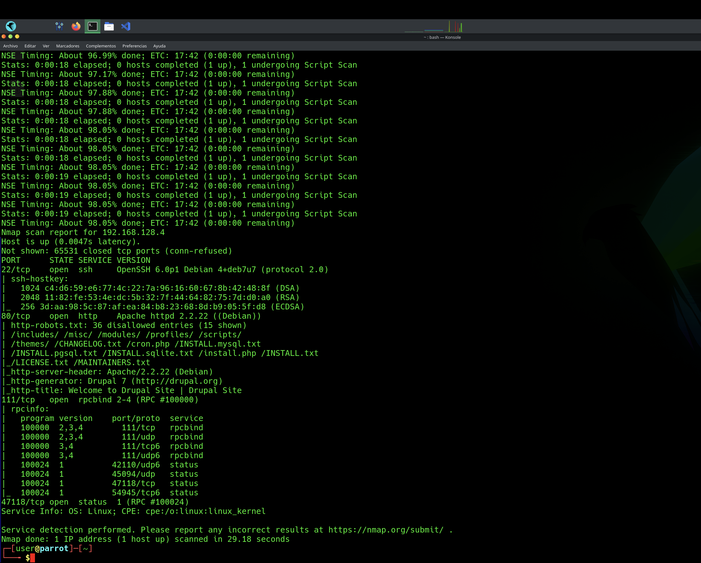

La salida final de Nmap sobre 192.168.128.4 muestra cuatro puertos TCP abiertos: 22/ssh (OpenSSH 6.0p1 Debian 4+deb7u7), 80/http (Apache httpd 2.2.22 Debian), 111/rpcbind 2-4 (RPC #100000) y 47118/status 1 (RPC #100024). Se reportan 65531 puertos TCP cerrados (conn-refused). Finaliza con 1 host activo en 29.18 segundos.

HTTP: título Welcome to Drupal Site | Drupal Site; generador Drupal 7; robots.txt con 36 entradas disallow, de las cuales Nmap muestra 15, incluyendo /CHANGELOG.txt. La tabla rpcinfo muestra registros TCP/UDP/TCP6/UDP6; no acredita un escaneo UDP independiente. Service Info indica Linux a partir del reconocimiento; no se usó -O en el comando visible previo.

La captura anterior EV-JDOG-001 contiene el comando nmap -sV -sC -p- 192.168.128.4 y Nmap 7.95 iniciado a las 17:41 UTC del 2026-10-03 (12:41 Colombia, precisión de minuto). La segunda captura fue enviada como continuación; la fecha exacta de captura no se registra. El puerto 47118 pertenece a esta observación de verificación en UTM (estrategia 1); no sustituirlo por 57249 del reconocimiento de servicios ni 59236 declarado en el recorrido web.

Inventario TCP observado; sin vulnerabilidad, CVE ni CVSS confirmados. La familia Drupal 7 está reportada, pero no su versión menor. Falta corroborar identidad DC-1 y aislamiento mediante configuración UTM, y conservar salida original en texto. No hay prueba de shell ni escalamiento.

### EV-DQH-001 · Descubrimiento ARP del recorrido SSH

Contexto: recorrido SSH (estrategia 3). Equipo: MnzHack. Fecha exacta: no-registrada.

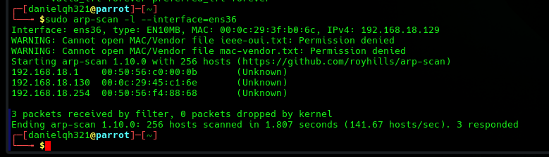

Respuestas ARP; .18.130 tiene MAC 00:0c:29:45:c1:6e. No muestra enumeración de usuarios SSH.

### EV-DQH-002 · Nmap del recorrido SSH primera parte

Contexto: recorrido SSH (estrategia 3). Equipo: MnzHack. Fecha exacta: no-registrada.

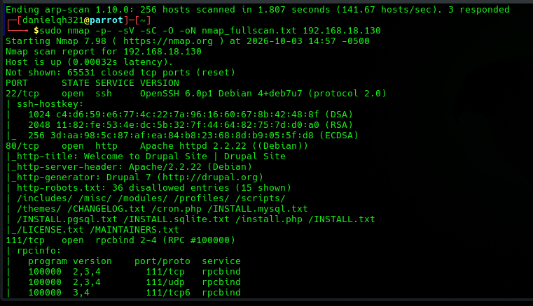

Escaneo iniciado 2026-10-03 14:57 -0500; muestra SSH, HTTP y RPC. No es Hydra.

### EV-DQH-003 · Nmap del recorrido SSH segunda parte

Contexto: recorrido SSH (estrategia 3). Equipo: MnzHack. Fecha exacta: no-registrada.

53497/tcp status y cierre Nmap; MAC 00:0c:29:45:c1:6e. No muestra login SSH.

### EV-DQH-004 · Página inicial Drupal del recorrido SSH

Contexto: recorrido SSH (estrategia 3). Equipo: MnzHack. Fecha exacta: no-registrada.

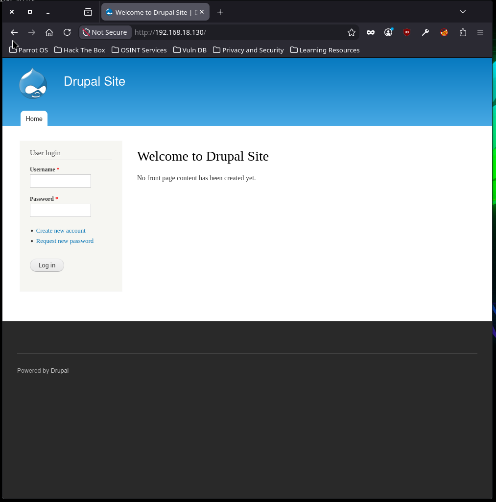

Página pública en .18.130. No muestra SUID ni escalamiento.

### EV-DQH-005 · WhatWeb del recorrido SSH

Contexto: recorrido SSH (estrategia 3). Equipo: MnzHack. Fecha exacta: no-registrada.

Fingerprinting Apache/Drupal/PHP. No muestra root ni bandera final.

### EV-JACD-003 · Shell inicial Drupalgeddon

Contexto: recorrido web (estrategia 2). Equipo: MnzHack. Fecha exacta: no-registrada.

Sesión del módulo drupal_drupageddon hacia .18.130; id y whoami muestran www-data. Fecha visible: 2026-10-03 15:42:07 -0500, apertura de sesión, no hora de captura.

### EV-JACD-004 · Shell con EUID root

Contexto: recorrido web (estrategia 2). Equipo: MnzHack. Fecha exacta: no-registrada.

/tmp/rootbash -p seguido de id: uid=33(www-data), euid=0(root). Prueba privilegio efectivo; falta hostname en la misma captura.

### EV-JACD-005 · Recuperación de contraseña mediante Hashcat

Contexto: recorrido web (estrategia 2). Equipo: MnzHack. Fecha exacta: no-registrada.

Hashcat modo 7900 muestra candidato recuperado; lista personalizada incluye esa misma contraseña. No demuestra debilidad intrínseca del algoritmo ni origen independiente de la lista.

### EV-JACD-006 · Ejecución PHP desde página administrativa

Contexto: recorrido web (estrategia 2). Equipo: MnzHack. Fecha exacta: no-registrada.

/node/3 muestra uid=33(www-data), hostname DC-1 y uname. Requiere sesión admin y activación previa de PHP Filter por el evaluador.

### EV-JACD-007 · Permisos de find

Contexto: recorrido web (estrategia 2). Equipo: MnzHack. Fecha exacta: no-registrada.

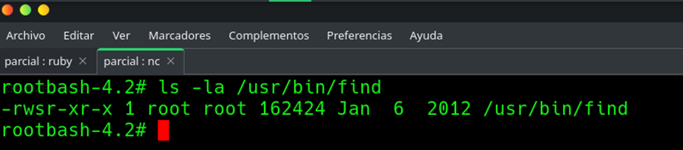

ls -la muestra propietario root y bit SUID en /usr/bin/find. Capturado ya desde prompt privilegiado: no asumir orden cronológico del descubrimiento.

### EV-JACD-008 · Preparación de shell temporal

Contexto: recorrido web (estrategia 2). Equipo: MnzHack. Fecha exacta: no-registrada.

Secuencia desde www-data: primer archivo conserva dueño www-data; segundo creado mediante find queda root y se habilita SUID. Artefacto /tmp/rootbash debe retirarse al cerrar.

### EV-JACD-009 · Identidad de sesión inicial

Contexto: recorrido web (estrategia 2). Equipo: MnzHack. Fecha exacta: no-registrada.

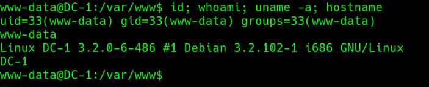

id, whoami, uname -a y hostname muestran www-data y DC-1. Vincular a sesión de EV-JACD-003 sin deducir continuidad solo por orden editorial.

### EV-JACD-010 · Lectura de banderas

Contexto: recorrido web (estrategia 2). Equipo: MnzHack. Fecha exacta: no-registrada.

Lectura de banderas incluida la final desde rootbash. La evidencia de EUID está en EV-JACD-004; lectura de flag sola no reemplaza identidad.

### EV-JACD-011 · Activación de PHP Filter

Contexto: recorrido web (estrategia 2). Equipo: MnzHack. Fecha exacta: no-registrada.

Mensaje de creación de formato PHP y guardado de configuración. Documenta modificación por el evaluador; no prueba que el módulo estuviera activo de origen.

### EV-JACD-012 · Creación de contenido PHP

Contexto: recorrido web (estrategia 2). Equipo: MnzHack. Fecha exacta: no-registrada.

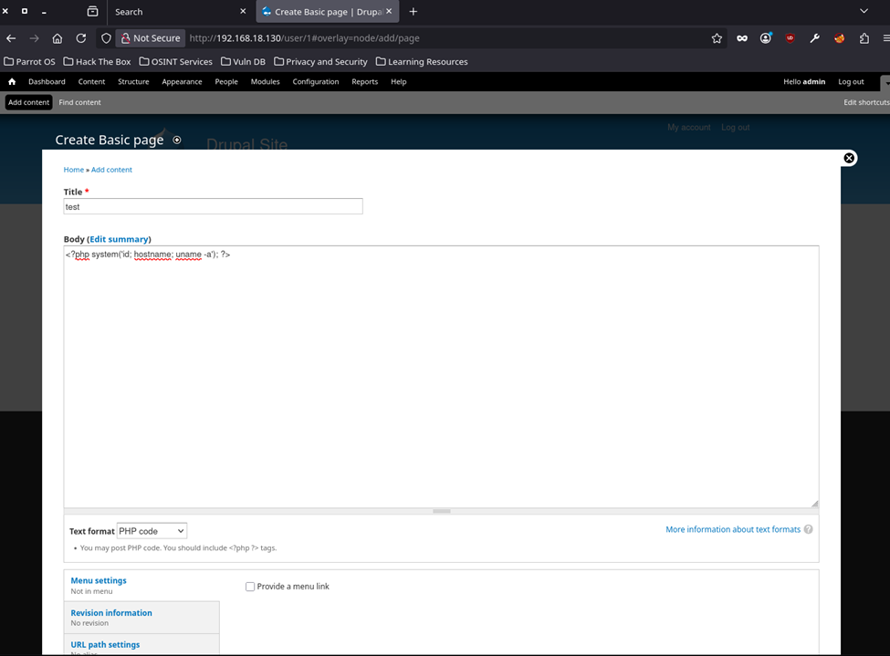

Formulario de página con código y formato PHP. Es precondición de EV-JACD-006, no explotación anónima.

### EV-JACD-013 · Sesión admin Drupal

Contexto: recorrido web (estrategia 2). Equipo: MnzHack. Fecha exacta: no-registrada.

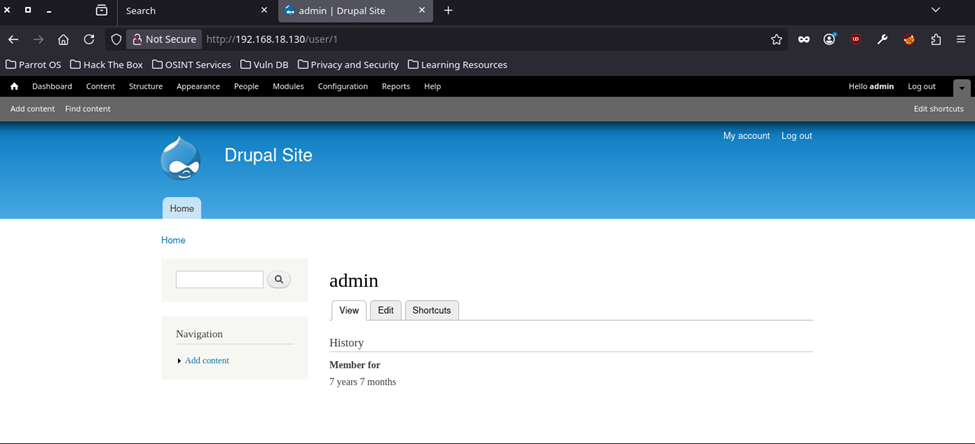

Interfaz Hello admin tras login reportado. Apoya acceso al CMS; la procedencia de hashes queda en notas sin captura de extracción.

### EV-JACD-014 · Opciones de Drupalgeddon

Contexto: recorrido web (estrategia 2). Equipo: MnzHack. Fecha exacta: no-registrada.

Opciones del módulo y payload visibles. Configuración no equivale a explotación; resultado en EV-JACD-003.

### EV-JACD-015 · Escaneo TCP completo del recorrido web

Contexto: recorrido web (estrategia 2). Equipo: MnzHack. Fecha exacta: no-registrada.

Nmap muestra 22/80/111/59236 TCP y MAC 00:0c:29:55:ea:9d; fecha visible 2026-10-03 11:28:13 sin zona en este archivo.

### EV-JACD-016 · Servicios del recorrido web primera parte

Contexto: recorrido web (estrategia 2). Equipo: MnzHack. Fecha exacta: no-registrada.

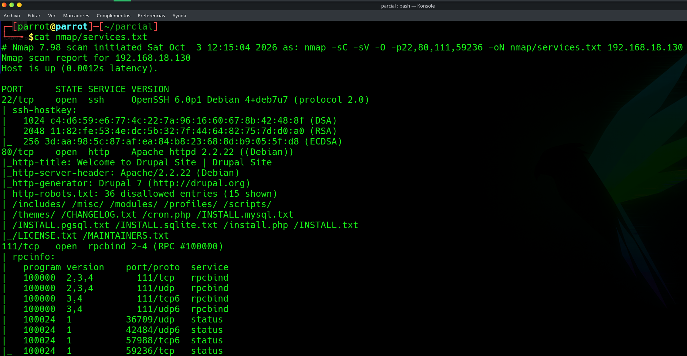

Nmap SSH/HTTP/rpcbind y Drupal 7; salida en archivo mostrada. Fecha 2026-10-03 12:15:04 sin zona visible.

### EV-JACD-017 · Servicios del recorrido web segunda parte

Contexto: recorrido web (estrategia 2). Equipo: MnzHack. Fecha exacta: no-registrada.

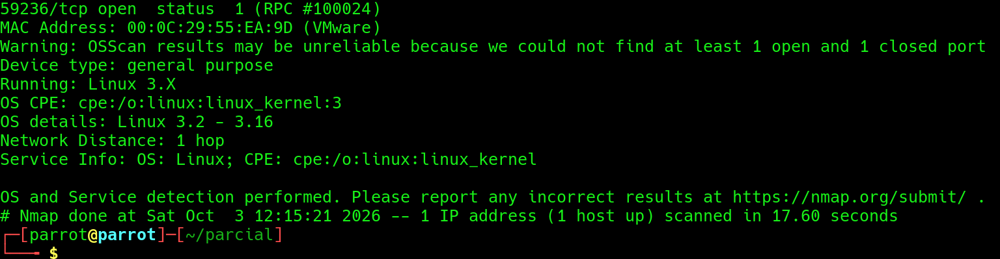

59236/tcp status; advierte condiciones poco fiables para fingerprinting de OS. No equiparar predicción con sistema corroborado.

### EV-JACD-018 · WhatWeb del recorrido web

Contexto: recorrido web (estrategia 2). Equipo: MnzHack. Fecha exacta: no-registrada.

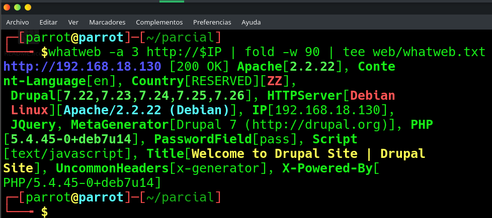

WhatWeb propone Drupal 7.22–7.26 como candidatos, no una versión exacta.

### EV-JACD-019 · Transferencia del archivo dirty.c

Contexto: recorrido web (estrategia 2). Equipo: MnzHack. Fecha exacta: no-registrada.

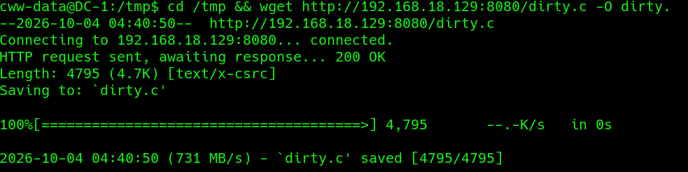

Solo muestra descarga HTTP de dirty.c. No acredita ejecución de Dirty COW, el fallo reportado ni ausencia de cambios posteriores.

### EV-JACD-020 · Inventario RPC del recorrido web

Contexto: recorrido web (estrategia 2). Equipo: MnzHack. Fecha exacta: no-registrada.

rpcinfo anuncia portmapper y status, aquí 55564/tcp. No se ve showmount ni salida que confirme ausencia universal de NFS.

### EV-DQH-006 · Métodos de autenticación SSH

Contexto: recorrido SSH (estrategia 3). Equipo: MnzHack. Fecha exacta: no-registrada.

Nmap anuncia publickey y password; inicio 2026-10-04 13:50 -0500, precisión de minuto. No muestra usuario válido por enumeración.

### EV-DQH-007 · Enumeración SSH iniciada

Contexto: recorrido SSH (estrategia 3). Equipo: MnzHack. Fecha exacta: no-registrada.

Metasploit muestra Checking for false positives. No hay resultado final que confirme usuarios.

### EV-DQH-008 · Hydra encuentra credencial

Contexto: recorrido SSH (estrategia 3). Equipo: MnzHack. Fecha exacta: no-registrada.

Hydra muestra login flag4 y contraseña encontrada. Inicio 2026-10-04 14:05:17, final 14:07:52 sin zona visible: 2 min 35 s, no segundos.

### EV-DQH-009 · Acceso SSH como flag4

Contexto: recorrido SSH (estrategia 3). Equipo: MnzHack. Fecha exacta: no-registrada.

ssh flag4@192.168.18.130 y prompt flag4@DC-1. La advertencia de fingerprint precede al login; no prueba ausencia de verificación fuera de captura.

### EV-DQH-010 · Lectura de flag4

Contexto: recorrido SSH (estrategia 3). Equipo: MnzHack. Fecha exacta: no-registrada.

Sesión flag4@DC-1, listado de home y lectura de flag4.txt.

### EV-DQH-011 · SUID find y EUID root

Contexto: recorrido SSH (estrategia 3). Equipo: MnzHack. Fecha exacta: no-registrada.

find SUID seguido de bash -p, whoami root e id uid=1001(flag4), euid=0(root). UID real no cambia a cero.

### EV-DQH-012 · EUID root y bandera final

Contexto: recorrido SSH (estrategia 3). Equipo: MnzHack. Fecha exacta: no-registrada.

Misma secuencia visible con id y lectura /root/thefinalflag.txt. Hostname solo en prompt inicial: conviene captura final explícita de hostname.

### EV-DQH-013 · Contenido web.config

Contexto: recorrido SSH (estrategia 3). Equipo: MnzHack. Fecha exacta: no-registrada.

Navegador muestra reglas XML de configuración. No se observan secretos ni se demuestra impacto de seguridad específico.

### EV-DQH-014 · Interfaces del recorrido SSH

Contexto: recorrido SSH (estrategia 3). Equipo: MnzHack. Fecha exacta: no-registrada.

ens36 192.168.18.129/24 y ens33 192.168.112.128/24. MAC objetivo .18.130 difiere de Recorrido web: no confundir instancias por IP repetida.

### EV-JACD-021 · Preparación de herramienta RPC

Contexto: recorrido web (estrategia 2). Equipo: MnzHack. Fecha exacta de captura: no-registrada.

**Acción y resultado observado:** sudo apt install -y rpcbind se ejecuta en Parrot. Es preparación del atacante, no modificación ni explotación demostrada del objetivo.

**Relevancia:** Completa el contexto de reconocimiento e investigación; no constituye por sí sola una vulnerabilidad.

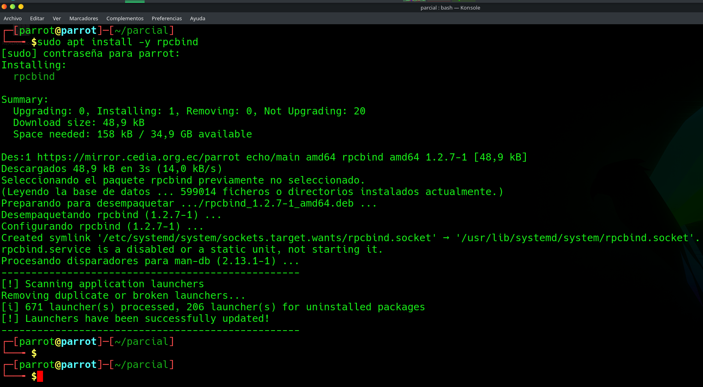

### EV-JACD-022 · Negociación SSH del recorrido web

Contexto: recorrido web (estrategia 2). Equipo: MnzHack. Fecha exacta de captura: no-registrada.

**Acción y resultado observado:** ssh -v muestra negociación con OpenSSH 6.0p1 y solicitud de aceptación de clave de host. No se observa login exitoso ni vulnerabilidad confirmada.

**Relevancia:** Completa el contexto de reconocimiento e investigación; no constituye por sí sola una vulnerabilidad.

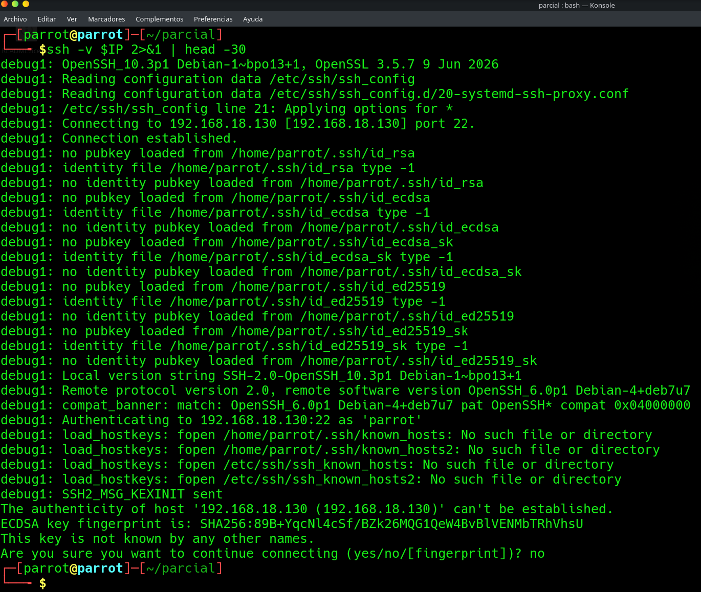

### EV-JACD-023 · Interfaces del atacante del recorrido web

Contexto: recorrido web (estrategia 2). Equipo: MnzHack. Fecha exacta de captura: no-registrada.

**Acción y resultado observado:** ip a muestra ens33 192.168.45.129/24 y ens36 192.168.18.129/24. La salida no demuestra por sí sola el modo NAT o Host-Only.

**Relevancia:** Completa el contexto de reconocimiento e investigación; no constituye por sí sola una vulnerabilidad.

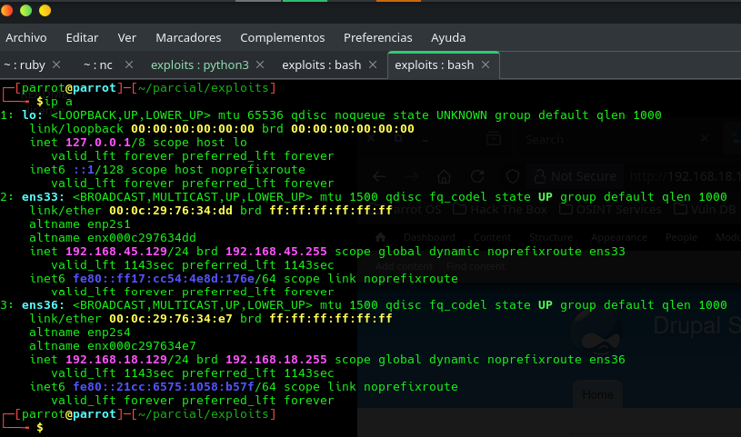

### EV-JACD-024 · Segunda sesión y conexión auxiliar

Contexto: recorrido web (estrategia 2). Equipo: MnzHack. Fecha exacta de captura: no-registrada.

**Acción y resultado observado:** Metasploit abre la sesión 11 el 2026-10-03 a las 16:04:01 -0500. Se observa preparación de una conexión a 192.168.18.129:4445 mediante FIFO /tmp/f. Es una sesión distinta de la sesión 4 de EV-JACD-003.

**Relevancia:** Complementa PT-001 sin reemplazar su validación ni revisión cruzada.

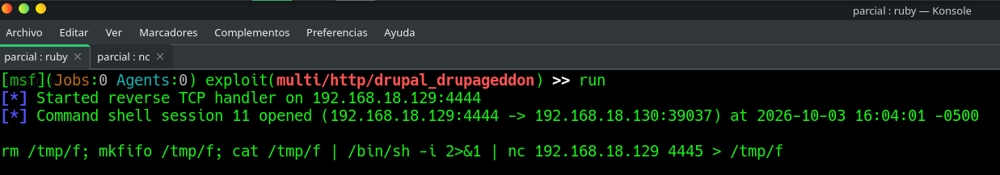

### EV-JACD-025 · Listener y shell sin TTY

Contexto: recorrido web (estrategia 2). Equipo: MnzHack. Fecha exacta de captura: no-registrada.

**Acción y resultado observado:** nc -lvnp 4445 recibe conexión de 192.168.18.130; id muestra uid=33(www-data). La advertencia indica ausencia de TTY y control de trabajos.

**Relevancia:** Complementa PT-001 sin reemplazar su validación ni revisión cruzada.

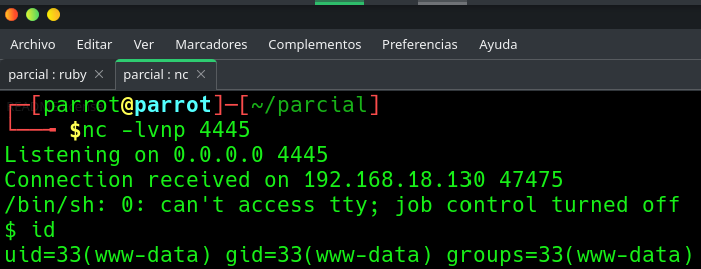

### EV-JACD-026 · Estabilización de la shell

Contexto: recorrido web (estrategia 2). Equipo: MnzHack. Fecha exacta de captura: no-registrada.

**Acción y resultado observado:** Se observa pty.spawn, error inicial de TERM no definido, exports y stty raw -echo; fg. El prompt vuelve a www-data@DC-1. Mejora interacción, no eleva privilegios.

**Relevancia:** Complementa PT-001 sin reemplazar su validación ni revisión cruzada.

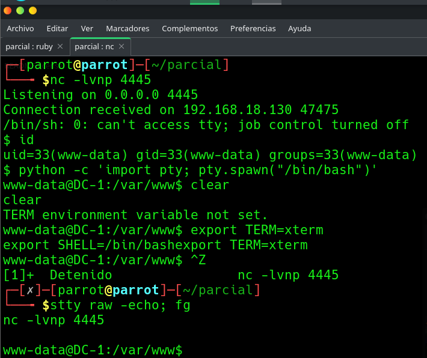

### EV-JACD-027 · Lectura de archivo shadow

Contexto: recorrido web (estrategia 2). Equipo: MnzHack. Fecha exacta de captura: no-registrada.

**Acción y resultado observado:** head -5 /etc/shadow muestra registros y material de hash desde prompt rootbash. Acredita acceso a un archivo sensible; no es el origen del hash Drupal de PT-003.

**Relevancia:** Complementa PT-002 sin reemplazar su validación ni revisión cruzada.

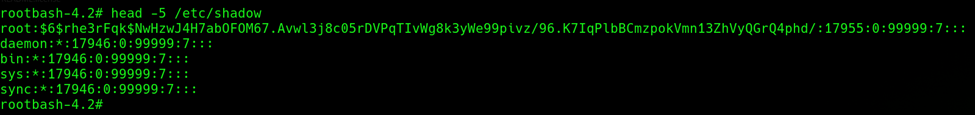

### EV-JACD-028 · Inventario SUID desde sesión privilegiada

Contexto: recorrido web (estrategia 2). Equipo: MnzHack. Fecha exacta de captura: no-registrada.

**Acción y resultado observado:** find / -perm -4000 -type f enumera ejecutables, incluidos /usr/bin/find y /tmp/rootbash. El prompt ya es rootbash: esta captura no acredita inventario previo al escalamiento.

**Relevancia:** Complementa PT-002 sin reemplazar su validación ni revisión cruzada.

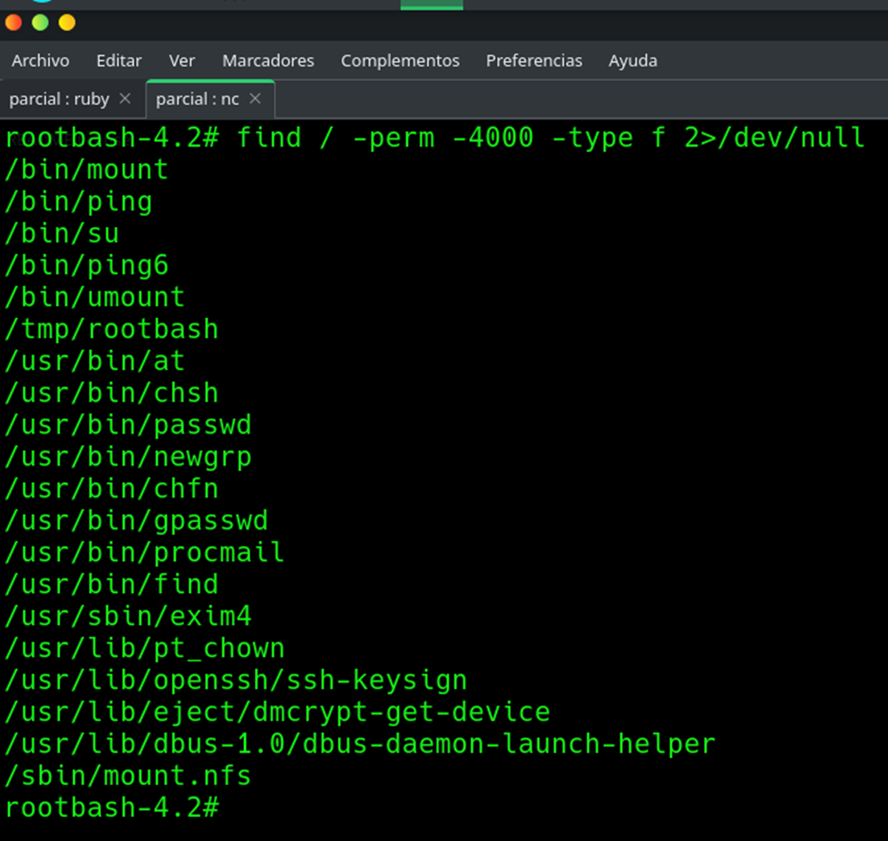

### EV-JACD-029 · Intento de enumeración sudo

Contexto: recorrido web (estrategia 2). Equipo: MnzHack. Fecha exacta de captura: no-registrada.

**Acción y resultado observado:** sudo -l devuelve bash: sudo: command not found. Acredita el fallo en esa sesión; no demuestra inexistencia de otras vías de escalamiento.

**Relevancia:** Complementa PT-002 sin reemplazar su validación ni revisión cruzada.

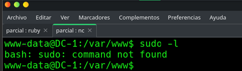

### EV-JACD-030 · Investigación de módulos Drupal

Contexto: recorrido web (estrategia 2). Equipo: MnzHack. Fecha exacta de captura: no-registrada.

**Acción y resultado observado:** Búsqueda de Drupal en msfconsole muestra módulos candidatos, incluido drupal_drupageddon. Un resultado de búsqueda no confirma aplicabilidad.

**Relevancia:** Complementa PT-001 sin reemplazar su validación ni revisión cruzada.

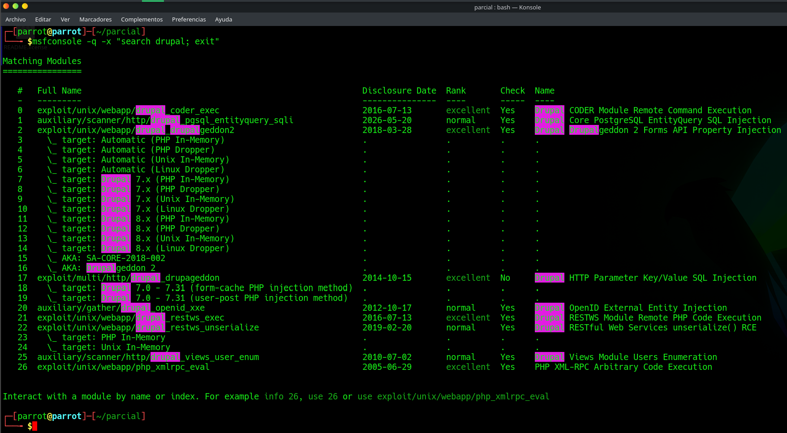

### EV-JACD-031 · Búsqueda Searchsploit Drupal

Contexto: recorrido web (estrategia 2). Equipo: MnzHack. Fecha exacta de captura: no-registrada.

**Acción y resultado observado:** searchsploit drupal 7.0 devuelve candidatos SQLi y otros resultados de distintas versiones. La selección necesita correlación con el objetivo y PoC propia.

**Relevancia:** Complementa PT-001 sin reemplazar su validación ni revisión cruzada.

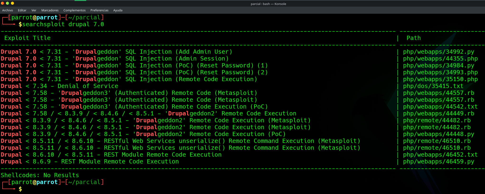

### EV-JACD-032 · Versión visible de Metasploit del recorrido web

Contexto: recorrido web (estrategia 2). Equipo: MnzHack. Fecha exacta de captura: no-registrada.

**Acción y resultado observado:** La consola muestra Metasploit v6.5.3-dev. Esto completa la versión visible del framework; no aporta hash ni revisión exacta del módulo instalado.

**Relevancia:** Complementa PT-001 sin reemplazar su validación ni revisión cruzada.

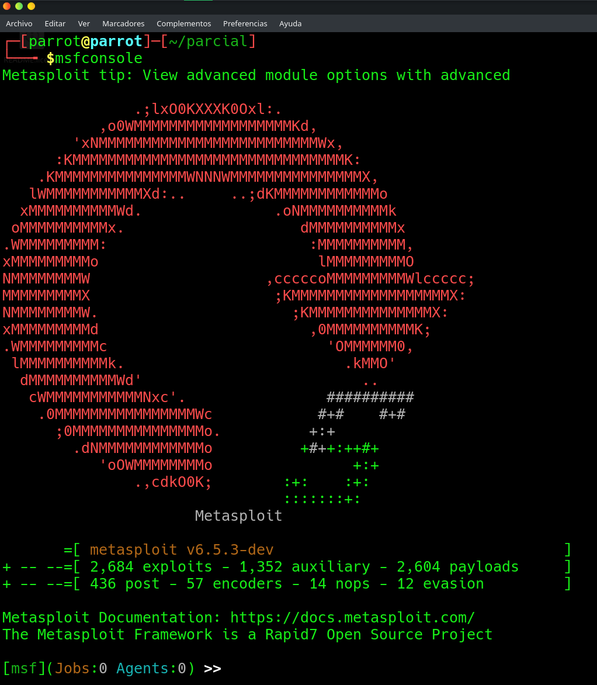

### EV-JACD-033 · Configuración explícita del módulo

Contexto: recorrido web (estrategia 2). Equipo: MnzHack. Fecha exacta de captura: no-registrada.

**Acción y resultado observado:** Se observan RHOSTS 192.168.18.130, LHOST 192.168.18.129, LPORT 4444 y PAYLOAD php/reverse_php. Relacionar con opciones EV-JACD-014 y sesión EV-JACD-003.

**Relevancia:** Complementa PT-001 sin reemplazar su validación ni revisión cruzada.

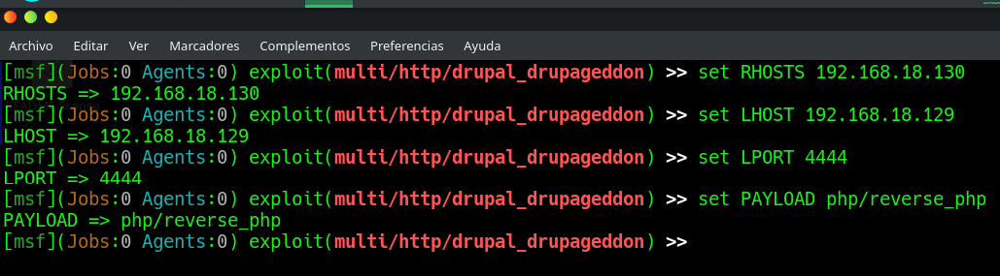

### EV-JACD-034 · Formulario de login administrativo

Contexto: recorrido web (estrategia 2). Equipo: MnzHack. Fecha exacta de captura: no-registrada.

**Acción y resultado observado:** Navegador en /user/login muestra usuario admin y contraseña ocultada por el formulario. No acredita éxito por sí solo; la sesión se observa en EV-JACD-013.

**Relevancia:** Complementa PT-003 sin reemplazar su validación ni revisión cruzada.

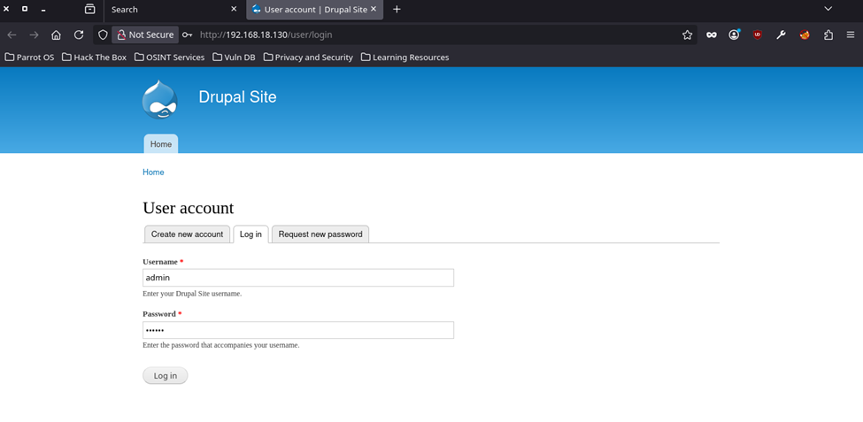

### EV-DQH-015 · Continuación de candidatos Drupal

Contexto: recorrido SSH (estrategia 3). Equipo: MnzHack. Fecha exacta de captura: no-registrada.

**Acción y resultado observado:** Listado Searchsploit incluye Drupalgeddon2 y múltiples módulos/versiones. No se observa ejecución de un exploit.

**Relevancia:** Complementa PT-005 sin reemplazar su validación ni revisión cruzada.

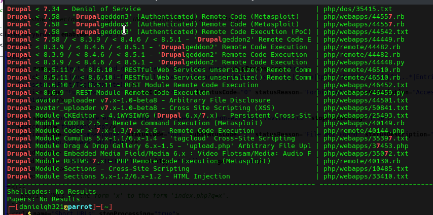

### EV-DQH-016 · Investigación Searchsploit sobre Apache

Contexto: recorrido SSH (estrategia 3). Equipo: MnzHack. Fecha exacta de captura: no-registrada.

**Acción y resultado observado:** searchsploit Apache 2.2.22 presenta resultados de componentes y versiones diferentes. No se valida una vulnerabilidad por coincidencia textual.

**Relevancia:** Completa el contexto de reconocimiento e investigación; no constituye por sí sola una vulnerabilidad.

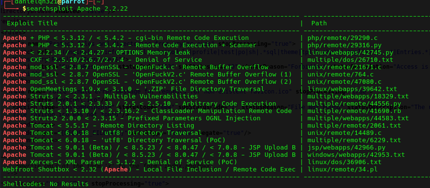

### EV-DQH-017 · Investigación Searchsploit sobre PHP

Contexto: recorrido SSH (estrategia 3). Equipo: MnzHack. Fecha exacta de captura: no-registrada.

**Acción y resultado observado:** searchsploit PHP 5.4.45 presenta numerosos productos asociados a PHP. No acredita que esos productos estén instalados.

**Relevancia:** Completa el contexto de reconocimiento e investigación; no constituye por sí sola una vulnerabilidad.

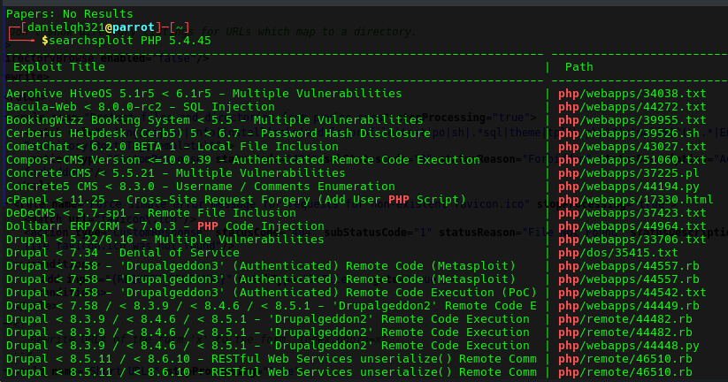

### EV-DQH-018 · Continuación de búsqueda PHP - tramo 2

Contexto: recorrido SSH (estrategia 3). Equipo: MnzHack. Fecha exacta de captura: no-registrada.

**Acción y resultado observado:** Listado de candidatos de varios productos. Evidencia de investigación, no de ejecución ni aplicabilidad al servidor.

**Relevancia:** Completa el contexto de reconocimiento e investigación; no constituye por sí sola una vulnerabilidad.

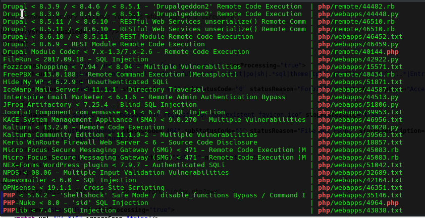

### EV-DQH-019 · Continuación de búsqueda PHP - tramo 3

Contexto: recorrido SSH (estrategia 3). Equipo: MnzHack. Fecha exacta de captura: no-registrada.

**Acción y resultado observado:** Fin de listado de candidatos; Shellcodes: No Results. No demuestra que PHP carezca de vulnerabilidades.

**Relevancia:** Completa el contexto de reconocimiento e investigación; no constituye por sí sola una vulnerabilidad.

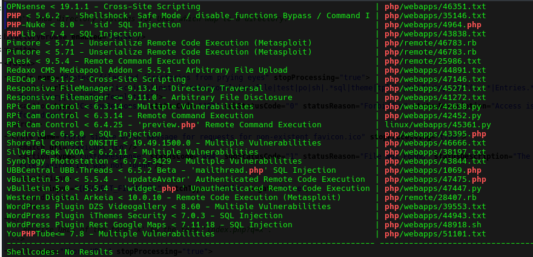

### EV-DQH-020 · Investigación Searchsploit sobre jQuery

Contexto: recorrido SSH (estrategia 3). Equipo: MnzHack. Fecha exacta de captura: no-registrada.

**Acción y resultado observado:** Búsqueda filtrada de jQuery devuelve componentes y versiones diferentes; no hay PoC XSS/SQLi realizada en esta captura.

**Relevancia:** Completa el contexto de reconocimiento e investigación; no constituye por sí sola una vulnerabilidad.

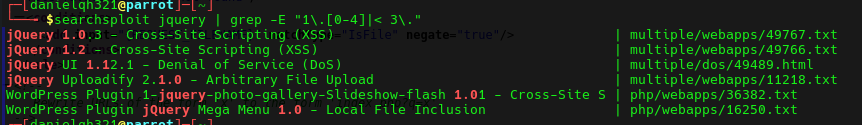

### EV-DQH-021 · Enumeración SSH final y usuarios candidatos

Contexto: recorrido SSH (estrategia 3). Equipo: MnzHack. Fecha exacta de captura: no-registrada.

**Acción y resultado observado:** Metasploit v6.5.4-dev ejecuta ssh_enumusers hasta Auxiliary module execution completed. No muestra un usuario identificado como válido. El editor muestra root, admin, user, flag4, test y www-data en usuarios_dc1.txt; flag4 ya era candidato de entrada.

**Relevancia:** Complementa PT-007 sin reemplazar su validación ni revisión cruzada.

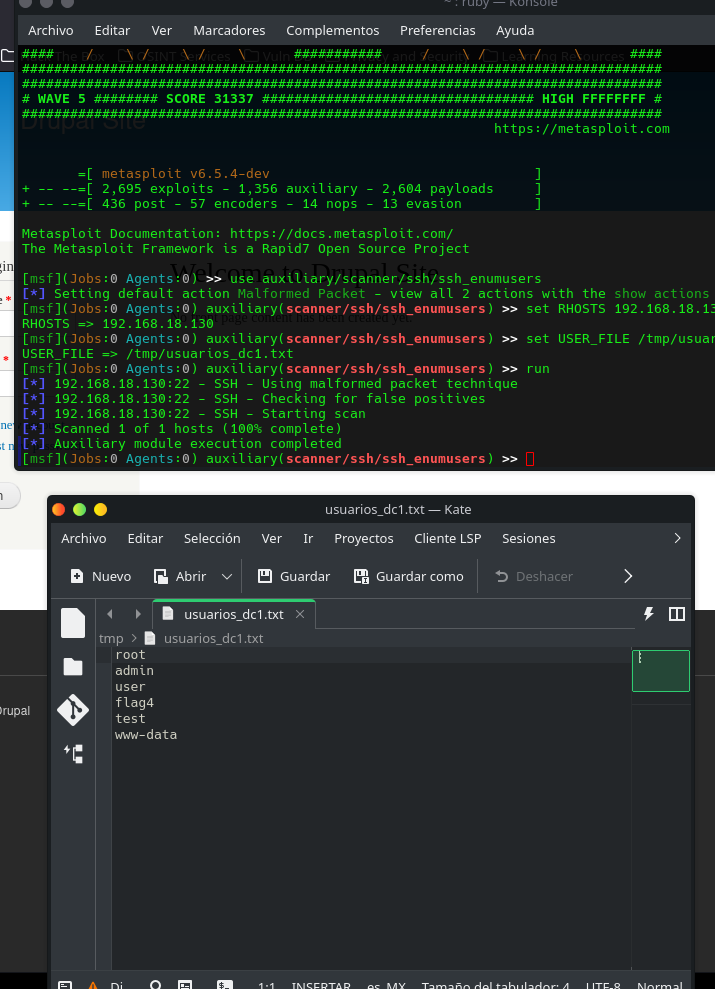

### EV-DQH-022 · Tecnologías reportadas por Wappalyzer

Contexto: recorrido SSH (estrategia 3). Equipo: MnzHack. Fecha exacta de captura: no-registrada.

**Acción y resultado observado:** La captura identifica Drupal 7, PHP 5.4.45, Apache 2.2.22, Debian y jQuery 1.4.4. Son identificaciones de herramienta, no validación de vulnerabilidad.

**Relevancia:** Complementa PT-005 sin reemplazar su validación ni revisión cruzada.

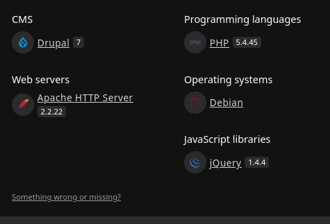

### EV-DQH-023 · Inicio de enumeración Gobuster

Contexto: recorrido SSH (estrategia 3). Equipo: MnzHack. Fecha exacta de captura: no-registrada.

**Acción y resultado observado:** gobuster dir sobre 192.168.18.130 con common.txt. Respuestas 403 indican acceso denegado, no lectura de archivos sensibles.

**Relevancia:** Completa el contexto de reconocimiento e investigación; no constituye por sí sola una vulnerabilidad.

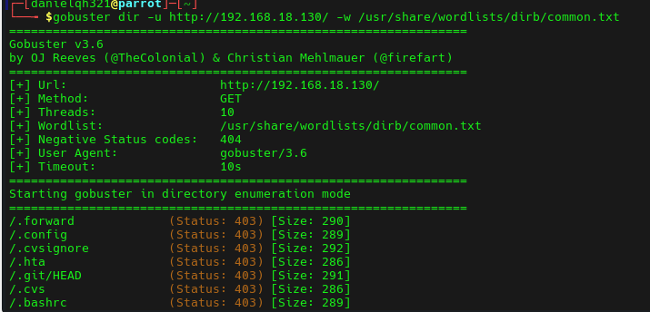

### EV-DQH-024 · Resultados intermedios Gobuster

Contexto: recorrido SSH (estrategia 3). Equipo: MnzHack. Fecha exacta de captura: no-registrada.

**Acción y resultado observado:** Se observan respuestas 403 y redirecciones 301 para variantes de rutas. No acredita que las rutas denegadas existan ni que se pueda acceder a su contenido.

**Relevancia:** Completa el contexto de reconocimiento e investigación; no constituye por sí sola una vulnerabilidad.

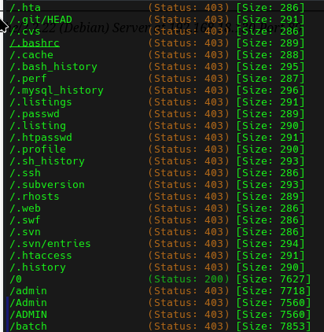

### EV-DQH-025 · Final de enumeración Gobuster

Contexto: recorrido SSH (estrategia 3). Equipo: MnzHack. Fecha exacta de captura: no-registrada.

**Acción y resultado observado:** Listado incluye web.config 200, robots.txt 200 y rutas con 301/403; progreso 4614/4615 y Finished. Permite seleccionar revisión manual, no afirmar explotación.

**Relevancia:** Complementa PT-006 sin reemplazar su validación ni revisión cruzada.

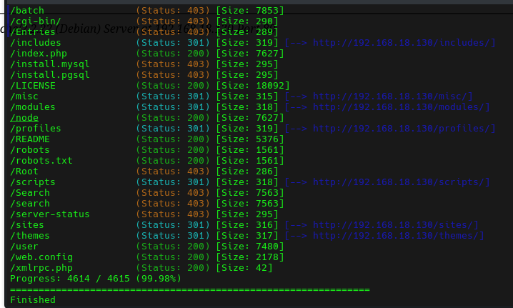

### EV-DQH-026 · Investigación Searchsploit sobre Drupal

Contexto: recorrido SSH (estrategia 3). Equipo: MnzHack. Fecha exacta de captura: no-registrada.

**Acción y resultado observado:** searchsploit drupal 7 devuelve exploits candidatos de distintas versiones y componentes. Justifica investigar; no demuestra que todos apliquen.

**Relevancia:** Complementa PT-005 sin reemplazar su validación ni revisión cruzada.

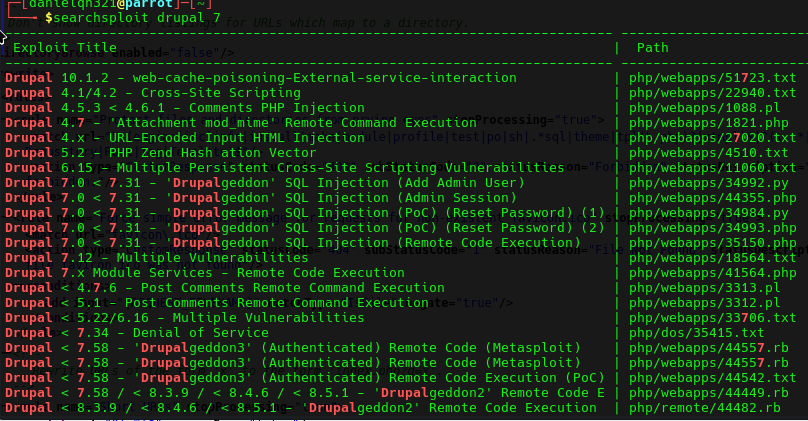

### EV-DQH-027 · Vista adicional de web.config

Contexto: recorrido SSH (estrategia 3). Equipo: MnzHack. Fecha exacta de captura: no-registrada.

**Acción y resultado observado:** Captura del XML web.config; reglas de configuración visibles sin credenciales observables. Es otra vista del mismo recurso, no otro hallazgo.

**Relevancia:** Complementa PT-006 sin reemplazar su validación ni revisión cruzada.

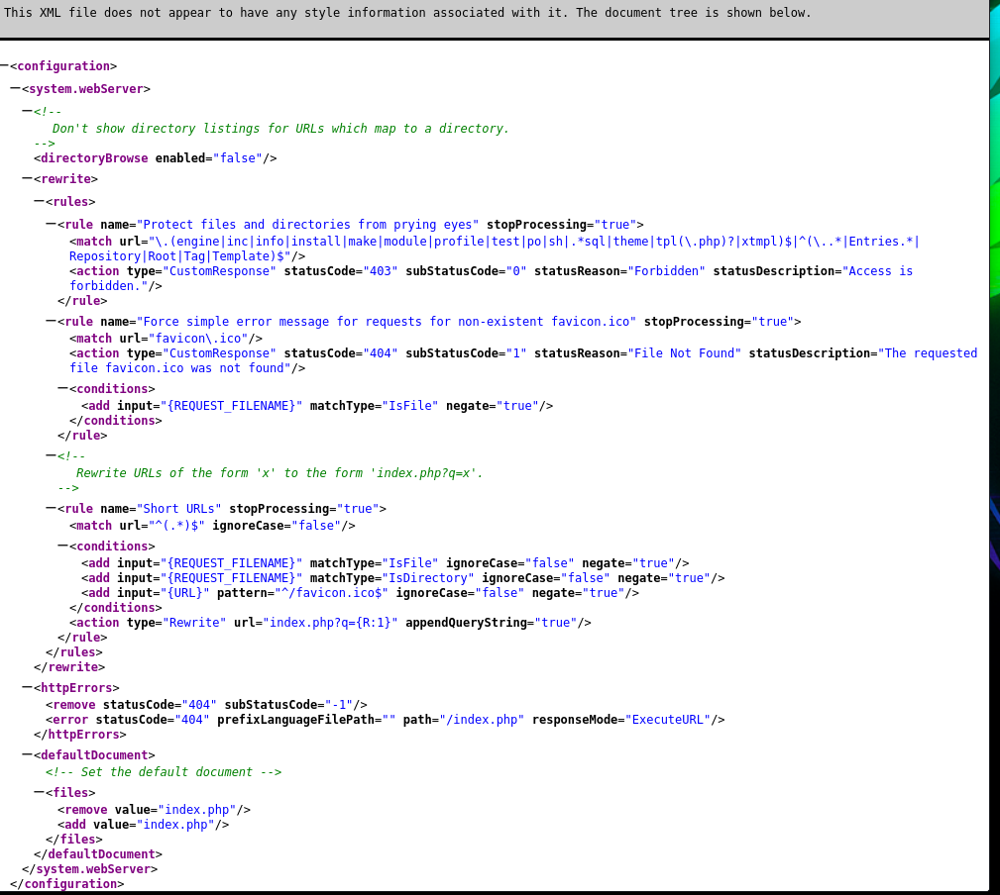
